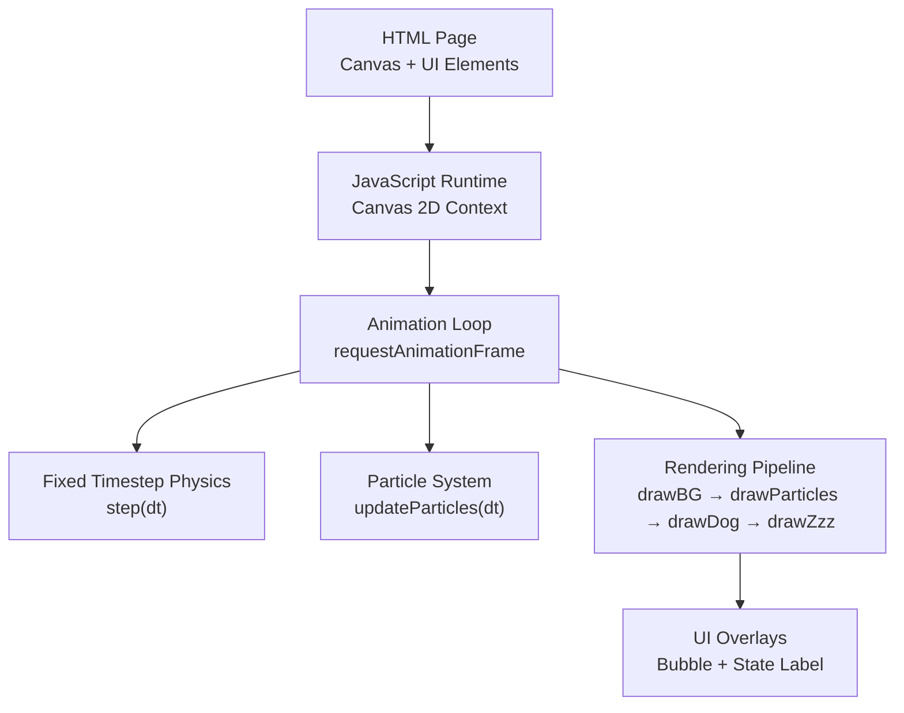
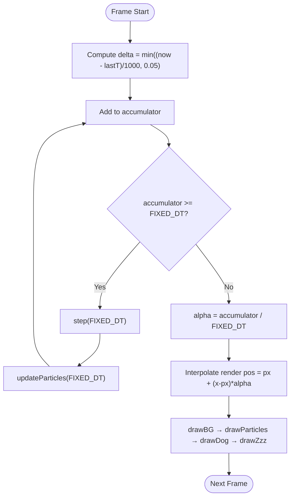
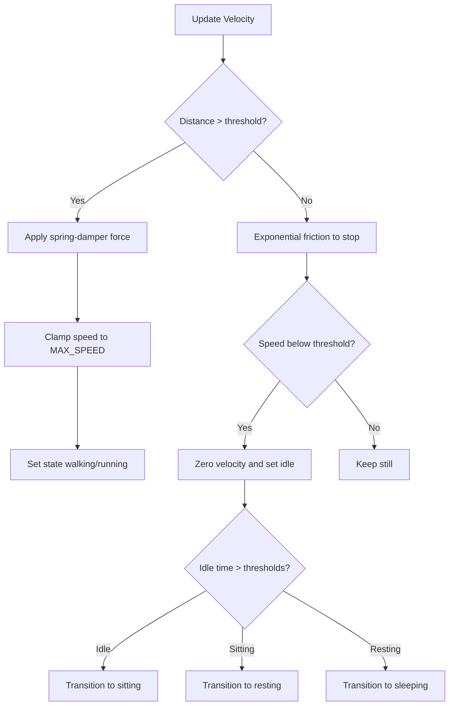
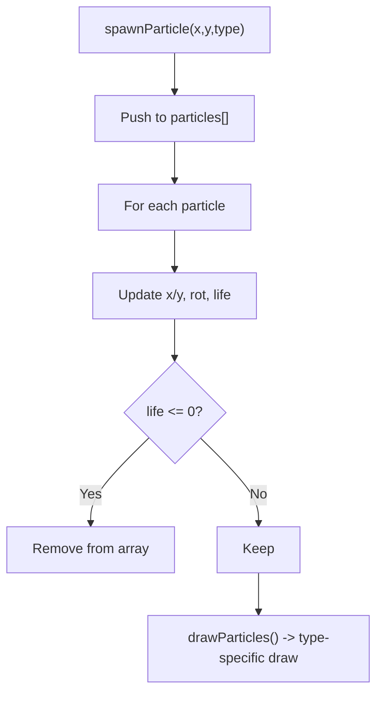
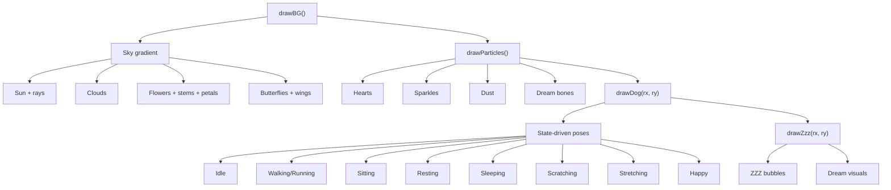
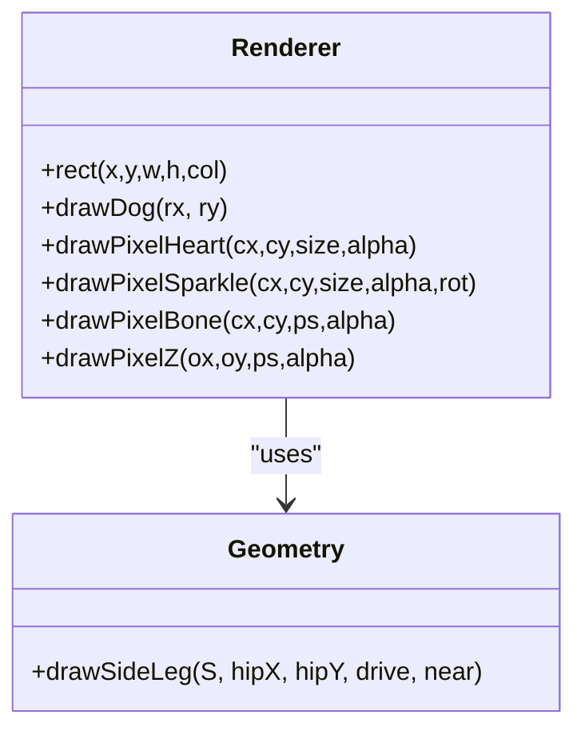
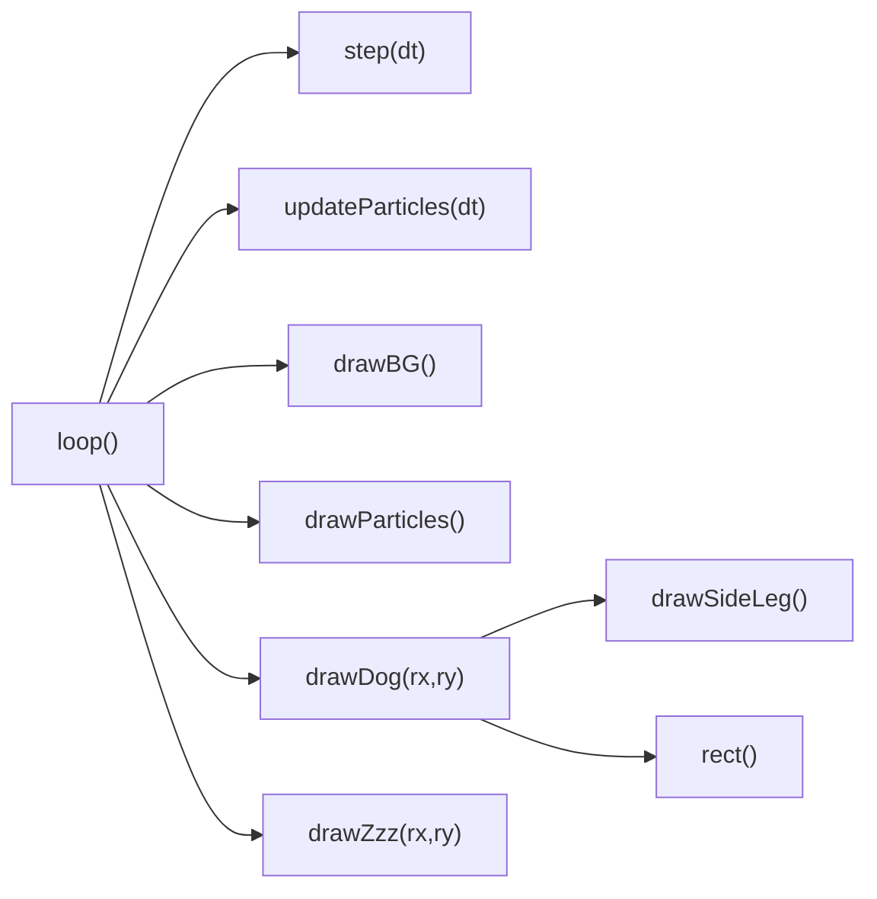

# Animation and Rendering

<cite>
**Referenced Files in This Document**
- [bernese-pixel-dog.html](file://bernese-pixel-dog.html)
</cite>

## Table of Contents
1. [Introduction](#introduction)
2. [Project Structure](#project-structure)
3. [Core Components](#core-components)
4. [Architecture Overview](#architecture-overview)
5. [Detailed Component Analysis](#detailed-component-analysis)
6. [Dependency Analysis](#dependency-analysis)
7. [Performance Considerations](#performance-considerations)
8. [Troubleshooting Guide](#troubleshooting-guide)
9. [Conclusion](#conclusion)
10. [Appendices](#appendices)

## Introduction
This document explains the animation and rendering system for a pixel-art character scene built with the HTML Canvas API. It focuses on the requestAnimationFrame-based animation loop with fixed timestep integration for deterministic physics, the rendering pipeline (background, particles, character, and state-specific overlays), pixel-art rendering techniques (custom rectangle drawing, coordinate transforms, and scaling), and practical performance and compatibility considerations.

## Project Structure
The entire application is implemented in a single HTML file. It defines:
- A full-screen canvas element
- Inline CSS for layout and pixelated rendering
- A JavaScript animation loop and rendering subsystem



**Diagram sources**
- [bernese-pixel-dog.html:41-44](file://bernese-pixel-dog.html#L41-L44)
- [bernese-pixel-dog.html:46-57](file://bernese-pixel-dog.html#L46-L57)
- [bernese-pixel-dog.html:770-794](file://bernese-pixel-dog.html#L770-L794)
- [bernese-pixel-dog.html:636-715](file://bernese-pixel-dog.html#L636-L715)
- [bernese-pixel-dog.html:93-104](file://bernese-pixel-dog.html#L93-L104)
- [bernese-pixel-dog.html:557-634](file://bernese-pixel-dog.html#L557-L634)
- [bernese-pixel-dog.html:257-555](file://bernese-pixel-dog.html#L257-L555)
- [bernese-pixel-dog.html:735-768](file://bernese-pixel-dog.html#L735-L768)

**Section sources**
- [bernese-pixel-dog.html:41-44](file://bernese-pixel-dog.html#L41-L44)
- [bernese-pixel-dog.html:46-57](file://bernese-pixel-dog.html#L46-L57)

## Core Components
- Canvas and context initialization with pixelated rendering
- Fixed timestep physics and animation loop
- Particle system with per-type updates and lifecycles
- Background rendering (sky gradient, sun, clouds, flowers, butterflies)
- Character renderer with state-driven animations and pixel-art geometry
- State-specific overlays (sleep ZZZ bubbles and dream visuals)
- UI overlays (speech bubble and state label)

**Section sources**
- [bernese-pixel-dog.html:46-57](file://bernese-pixel-dog.html#L46-L57)
- [bernese-pixel-dog.html:636-715](file://bernese-pixel-dog.html#L636-L715)
- [bernese-pixel-dog.html:93-104](file://bernese-pixel-dog.html#L93-L104)
- [bernese-pixel-dog.html:557-634](file://bernese-pixel-dog.html#L557-L634)
- [bernese-pixel-dog.html:257-555](file://bernese-pixel-dog.html#L257-L555)
- [bernese-pixel-dog.html:735-768](file://bernese-pixel-dog.html#L735-L768)
- [bernese-pixel-dog.html:186-198](file://bernese-pixel-dog.html#L186-L198)
- [bernese-pixel-dog.html:713-715](file://bernese-pixel-dog.html#L713-L715)

## Architecture Overview
The system uses a classic game loop pattern:
- A requestAnimationFrame callback drives the loop
- Delta time is clamped and accumulated into a fixed-timestep accumulator
- The physics step runs at a fixed interval until the accumulator is exhausted
- Rendering interpolates between previous and current positions for smooth motion
- Background, particles, character, and overlays are drawn in order

```mermaid
sequenceDiagram
participant RAF as "requestAnimationFrame"
participant Loop as "loop(now)"
participant Acc as "Accumulator"
participant Step as "step(dt)"
participant Part as "updateParticles(dt)"
participant Draw as "drawBG/drawParticles/drawDog/drawZzz"
participant UI as "Bubble/State Label"
RAF->>Loop : "now"
Loop->>Loop : "frame = clamp((now - lastT)/1000, 0.05)"
Loop->>Acc : "accumulate += frame"
loop "while accumulator >= FIXED_DT"
Loop->>Step : "step(FIXED_DT)"
Loop->>Part : "updateParticles(FIXED_DT)"
end
Loop->>Loop : "alpha = accumulator / FIXED_DT"
Loop->>Draw : "drawBG()"
Loop->>Draw : "drawParticles()"
Loop->>Draw : "drawDog(px + (x-px)*alpha, py + (y-py)*alpha)"
alt "sleeping"
Loop->>Draw : "drawZzz()"
end
Draw-->>UI : "bubble/state label updates"
Loop->>RAF : "requestAnimationFrame(loop)"
```

**Diagram sources**
- [bernese-pixel-dog.html:770-794](file://bernese-pixel-dog.html#L770-L794)
- [bernese-pixel-dog.html:636-715](file://bernese-pixel-dog.html#L636-L715)
- [bernese-pixel-dog.html:93-104](file://bernese-pixel-dog.html#L93-L104)
- [bernese-pixel-dog.html:557-634](file://bernese-pixel-dog.html#L557-L634)
- [bernese-pixel-dog.html:257-555](file://bernese-pixel-dog.html#L257-L555)
- [bernese-pixel-dog.html:735-768](file://bernese-pixel-dog.html#L735-L768)
- [bernese-pixel-dog.html:186-198](file://bernese-pixel-dog.html#L186-L198)
- [bernese-pixel-dog.html:713-715](file://bernese-pixel-dog.html#L713-L715)

## Detailed Component Analysis

### Animation Loop and Fixed Timestep Integration
- Delta time is computed from the last frame and clamped to a maximum to prevent spikes
- An accumulator holds fractional fixed steps
- While accumulator >= fixed step, the physics and particle systems advance by the fixed step
- Rendering interpolates between previous and current positions using the fraction of the next step



**Diagram sources**
- [bernese-pixel-dog.html:770-794](file://bernese-pixel-dog.html#L770-L794)
- [bernese-pixel-dog.html:636-715](file://bernese-pixel-dog.html#L636-L715)
- [bernese-pixel-dog.html:93-104](file://bernese-pixel-dog.html#L93-L104)

**Section sources**
- [bernese-pixel-dog.html:770-794](file://bernese-pixel-dog.html#L770-L794)

### Physics and State Machine
- Spring-damper movement toward target with velocity clamping
- State transitions based on elapsed idle time and activity
- Gait and animation speed synchronized to movement
- Sleeping triggers dream visuals and paw twitching



**Diagram sources**
- [bernese-pixel-dog.html:636-715](file://bernese-pixel-dog.html#L636-L715)

**Section sources**
- [bernese-pixel-dog.html:636-715](file://bernese-pixel-dog.html#L636-L715)

### Particle System
- Per-type particle structs with position, velocity, rotation, size, and lifetime
- Updates apply gravity-like effects, rotation, and decay
- Removal when lifetime expires
- Drawing routines for hearts, sparkles, dust, and dream bones



**Diagram sources**
- [bernese-pixel-dog.html:79-104](file://bernese-pixel-dog.html#L79-L104)
- [bernese-pixel-dog.html:145-162](file://bernese-pixel-dog.html#L145-L162)
- [bernese-pixel-dog.html:106-129](file://bernese-pixel-dog.html#L106-L129)
- [bernese-pixel-dog.html:131-143](file://bernese-pixel-dog.html#L131-L143)
- [bernese-pixel-dog.html:164-184](file://bernese-pixel-dog.html#L164-L184)

**Section sources**
- [bernese-pixel-dog.html:79-104](file://bernese-pixel-dog.html#L79-L104)
- [bernese-pixel-dog.html:145-162](file://bernese-pixel-dog.html#L145-L162)

### Rendering Pipeline
- Background: sky gradient, sun with rotating rays, clouds, animated flowers, fluttering butterflies
- Particles: drawn before the character for depth ordering
- Character: pixel-art geometry with state-driven poses and animations
- Sleep overlay: ZZZ bubbles and dream visuals (bones and hearts)



**Diagram sources**
- [bernese-pixel-dog.html:557-634](file://bernese-pixel-dog.html#L557-L634)
- [bernese-pixel-dog.html:145-162](file://bernese-pixel-dog.html#L145-L162)
- [bernese-pixel-dog.html:257-555](file://bernese-pixel-dog.html#L257-L555)
- [bernese-pixel-dog.html:735-768](file://bernese-pixel-dog.html#L735-L768)

**Section sources**
- [bernese-pixel-dog.html:557-634](file://bernese-pixel-dog.html#L557-L634)
- [bernese-pixel-dog.html:257-555](file://bernese-pixel-dog.html#L257-L555)
- [bernese-pixel-dog.html:735-768](file://bernese-pixel-dog.html#L735-L768)

### Pixel-Art Rendering Techniques
- Custom rectangle drawing with rounding to nearest integer for crisp pixels
- Coordinate transforms: translation and scaling around the character origin
- Scaling by a size factor derived from the base size to support different character sizes
- Pattern-based drawing for hearts, sparkles, bones, and ZZZ bubbles



**Diagram sources**
- [bernese-pixel-dog.html:200-201](file://bernese-pixel-dog.html#L200-L201)
- [bernese-pixel-dog.html:231-255](file://bernese-pixel-dog.html#L231-L255)
- [bernese-pixel-dog.html:257-555](file://bernese-pixel-dog.html#L257-L555)
- [bernese-pixel-dog.html:106-129](file://bernese-pixel-dog.html#L106-L129)
- [bernese-pixel-dog.html:131-143](file://bernese-pixel-dog.html#L131-L143)
- [bernese-pixel-dog.html:164-184](file://bernese-pixel-dog.html#L164-L184)
- [bernese-pixel-dog.html:717-733](file://bernese-pixel-dog.html#L717-L733)

**Section sources**
- [bernese-pixel-dog.html:200-201](file://bernese-pixel-dog.html#L200-L201)
- [bernese-pixel-dog.html:231-255](file://bernese-pixel-dog.html#L231-L255)
- [bernese-pixel-dog.html:257-555](file://bernese-pixel-dog.html#L257-L555)
- [bernese-pixel-dog.html:106-129](file://bernese-pixel-dog.html#L106-L129)
- [bernese-pixel-dog.html:131-143](file://bernese-pixel-dog.html#L131-L143)
- [bernese-pixel-dog.html:164-184](file://bernese-pixel-dog.html#L164-L184)
- [bernese-pixel-dog.html:717-733](file://bernese-pixel-dog.html#L717-L733)

### Interpolation and Smooth Motion
- Previous and current positions are stored
- Interpolation factor alpha uses the remaining accumulator divided by the fixed step
- Rendered position is computed as a linear interpolation between px/py and x/y

**Section sources**
- [bernese-pixel-dog.html:770-794](file://bernese-pixel-dog.html#L770-L794)

### State-Specific Overlays
- Sleep: ZZZ bubbles with floating animation and dream visuals (bones and hearts)
- Resting: occasional sparkles
- Speech bubble: animated visibility with CSS transitions

**Section sources**
- [bernese-pixel-dog.html:735-768](file://bernese-pixel-dog.html#L735-L768)
- [bernese-pixel-dog.html:781-786](file://bernese-pixel-dog.html#L781-L786)
- [bernese-pixel-dog.html:186-198](file://bernese-pixel-dog.html#L186-L198)

## Dependency Analysis
- The loop depends on step() and updateParticles() for deterministic updates
- Rendering depends on drawBG(), drawParticles(), drawDog(), and drawZzz()
- drawDog() depends on internal state and helper functions for geometry and scaling
- UI overlays depend on DOM elements and CSS classes



**Diagram sources**
- [bernese-pixel-dog.html:770-794](file://bernese-pixel-dog.html#L770-L794)
- [bernese-pixel-dog.html:636-715](file://bernese-pixel-dog.html#L636-L715)
- [bernese-pixel-dog.html:93-104](file://bernese-pixel-dog.html#L93-L104)
- [bernese-pixel-dog.html:557-634](file://bernese-pixel-dog.html#L557-L634)
- [bernese-pixel-dog.html:257-555](file://bernese-pixel-dog.html#L257-L555)
- [bernese-pixel-dog.html:735-768](file://bernese-pixel-dog.html#L735-L768)
- [bernese-pixel-dog.html:231-255](file://bernese-pixel-dog.html#L231-L255)
- [bernese-pixel-dog.html:200-201](file://bernese-pixel-dog.html#L200-L201)

**Section sources**
- [bernese-pixel-dog.html:770-794](file://bernese-pixel-dog.html#L770-L794)
- [bernese-pixel-dog.html:257-555](file://bernese-pixel-dog.html#L257-L555)

## Performance Considerations
- Frame rate limiting: clamp delta time to a maximum to avoid spikes
- Fixed timestep: ensures deterministic physics regardless of frame jitter
- Efficient drawing:
  - Round coordinates to integers to avoid blurry pixels
  - Prefer simple fills and strokes; minimize globalAlpha switches
  - Draw backgrounds once per frame before objects
  - Reuse patterns and shapes (e.g., pixel art blocks)
- Memory management:
  - Remove dead particles immediately to keep arrays small
  - Avoid frequent allocations inside tight loops
- Particle optimization:
  - Use per-type branches to avoid unnecessary computations
  - Limit particle count by controlling spawn rates
- Rendering order:
  - Background → particles → character → overlays for correct layering

[No sources needed since this section provides general guidance]

## Troubleshooting Guide
- Jittery movement:
  - Verify fixed timestep accumulation and interpolation are enabled
  - Check that delta is clamped and accumulator is used
- Blurry pixels:
  - Ensure all drawing uses rounded coordinates
  - Confirm imageSmoothingEnabled is disabled
- Stuttering:
  - Reduce particle count or spawn frequency
  - Simplify per-frame calculations
- State not updating:
  - Confirm pointer events and keyboard handlers reset states appropriately
  - Check idle timers and thresholds

**Section sources**
- [bernese-pixel-dog.html:770-794](file://bernese-pixel-dog.html#L770-L794)
- [bernese-pixel-dog.html:46-57](file://bernese-pixel-dog.html#L46-L57)
- [bernese-pixel-dog.html:796-822](file://bernese-pixel-dog.html#L796-L822)
- [bernese-pixel-dog.html:834-850](file://bernese-pixel-dog.html#L834-L850)

## Conclusion
The system combines a robust requestAnimationFrame loop with fixed timestep integration to deliver smooth, deterministic animation. The rendering pipeline prioritizes crisp pixel-art aesthetics through precise coordinate rounding, scalable geometry, and layered composition. With careful attention to particle lifecycle and rendering order, the scene remains responsive and visually coherent across devices.

## Appendices

### Example References
- Main loop implementation: [bernese-pixel-dog.html:770-794](file://bernese-pixel-dog.html#L770-L794)
- Fixed timestep physics: [bernese-pixel-dog.html:636-715](file://bernese-pixel-dog.html#L636-L715)
- Particle system: [bernese-pixel-dog.html:79-104](file://bernese-pixel-dog.html#L79-L104)
- Background rendering: [bernese-pixel-dog.html:557-634](file://bernese-pixel-dog.html#L557-L634)
- Character renderer: [bernese-pixel-dog.html:257-555](file://bernese-pixel-dog.html#L257-L555)
- Sleep overlay: [bernese-pixel-dog.html:735-768](file://bernese-pixel-dog.html#L735-L768)
- Interpolation technique: [bernese-pixel-dog.html:774-776](file://bernese-pixel-dog.html#L774-L776)
- Rendering order: [bernese-pixel-dog.html:777-780](file://bernese-pixel-dog.html#L777-L780)