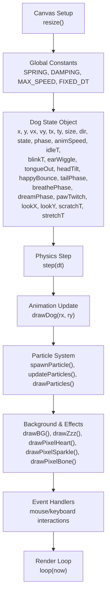
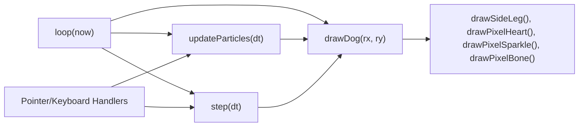

# Core Systems

<cite>
**Referenced Files in This Document**
- [bernese-pixel-dog.html](file://bernese-pixel-dog.html)
</cite>

## Table of Contents
1. [Introduction](#introduction)
2. [Project Structure](#project-structure)
3. [Core Components](#core-components)
4. [Architecture Overview](#architecture-overview)
5. [Detailed Component Analysis](#detailed-component-analysis)
6. [Dependency Analysis](#dependency-analysis)
7. [Performance Considerations](#performance-considerations)
8. [Troubleshooting Guide](#troubleshooting-guide)
9. [Conclusion](#conclusion)
10. [Appendices](#appendices)

## Introduction
This document explains the core systems that power the Bernese Pixel Dog animation. It covers:
- Physics engine with spring-damper forces, velocity clamping, and boundary constraints
- Character animation system with pixel-art drawing functions, state-dependent rendering, and animation timing
- State management architecture with seven behavioral states and transitions
- Particle system with four effect types and their physics properties
- Configuration options, performance characteristics, and integration patterns

## Project Structure
The entire implementation resides in a single HTML file that defines constants, global state, rendering functions, and the game loop. The structure is procedural and self-contained, with no external dependencies.



**Diagram sources**
- [bernese-pixel-dog.html:51-57](file://bernese-pixel-dog.html#L51-L57)
- [bernese-pixel-dog.html:59-73](file://bernese-pixel-dog.html#L59-L73)
- [bernese-pixel-dog.html:636-715](file://bernese-pixel-dog.html#L636-L715)
- [bernese-pixel-dog.html:257-555](file://bernese-pixel-dog.html#L257-L555)
- [bernese-pixel-dog.html:78-162](file://bernese-pixel-dog.html#L78-L162)
- [bernese-pixel-dog.html:557-634](file://bernese-pixel-dog.html#L557-L634)
- [bernese-pixel-dog.html:796-850](file://bernese-pixel-dog.html#L796-L850)
- [bernese-pixel-dog.html:770-794](file://bernese-pixel-dog.html#L770-L794)

**Section sources**
- [bernese-pixel-dog.html:51-57](file://bernese-pixel-dog.html#L51-L57)
- [bernese-pixel-dog.html:59-73](file://bernese-pixel-dog.html#L59-L73)
- [bernese-pixel-dog.html:770-794](file://bernese-pixel-dog.html#L770-L794)

## Core Components
- Physics engine: Spring-damper force application, velocity clamping, boundary constraints, and state-driven movement
- Animation system: Pixel-art drawing routines for all body parts, state-dependent rendering, and timing
- State manager: Seven states with explicit transitions and periodic behaviors
- Particle system: Four effect types with distinct physics and lifecycles
- Render loop: Fixed-timestep integration with interpolation for smooth motion

**Section sources**
- [bernese-pixel-dog.html:636-715](file://bernese-pixel-dog.html#L636-L715)
- [bernese-pixel-dog.html:257-555](file://bernese-pixel-dog.html#L257-L555)
- [bernese-pixel-dog.html:78-162](file://bernese-pixel-dog.html#L78-L162)
- [bernese-pixel-dog.html:770-794](file://bernese-pixel-dog.html#L770-L794)

## Architecture Overview
The system integrates physics, animation, and effects into a single render loop. Physics updates occur at a fixed timestep; the renderer interpolates between previous and current positions for smoothness. Particles are spawned by events and update independently.

```mermaid
sequenceDiagram
participant User as "User Input"
participant Loop as "Render Loop (loop)"
participant Step as "Physics (step)"
participant Draw as "Renderer (drawDog, drawParticles)"
participant Part as "Particle System"
participant BG as "Background"
User->>Loop : Pointer/Keyboard events
Loop->>Step : step(FIXED_DT)
Step-->>Loop : Updated dog state (position, velocity, state)
Loop->>Part : updateParticles(FIXED_DT)
Loop->>Draw : drawBG(), drawParticles(), drawDog(rx, ry)
Draw-->>Loop : Visual output
Note over Loop,Draw : Interpolation : rx, ry = lerp(px, x), lerp(py, y)
```

**Diagram sources**
- [bernese-pixel-dog.html:770-794](file://bernese-pixel-dog.html#L770-L794)
- [bernese-pixel-dog.html:636-715](file://bernese-pixel-dog.html#L636-L715)
- [bernese-pixel-dog.html:78-162](file://bernese-pixel-dog.html#L78-L162)
- [bernese-pixel-dog.html:557-634](file://bernese-pixel-dog.html#L557-L634)

## Detailed Component Analysis

### Physics Engine
The physics engine applies spring-damper forces toward a target position, clamps velocity, and enforces boundary constraints. It also sets the movement state based on speed and direction.

Key behaviors:
- Force calculation: spring acceleration toward target minus damping proportional to velocity
- Velocity clamp: cap speed at a configurable maximum
- Movement state: walking vs running based on speed threshold
- Boundary constraints: keep the dog within vertical and horizontal bounds
- Idle timer and state transitions: automatic transitions from idle to sitting, resting, sleeping

Implementation highlights:
- Spring-damper force application and velocity updates
- Speed-based state selection and direction flip
- Idle timer resets on movement and triggers state progression
- Boundary enforcement and friction when near target

Usage patterns:
- Called inside the fixed-time loop with a constant timestep
- Uses delta time scaled to a fixed rate for numerical stability

**Section sources**
- [bernese-pixel-dog.html:636-715](file://bernese-pixel-dog.html#L636-L715)
- [bernese-pixel-dog.html:641-647](file://bernese-pixel-dog.html#L641-L647)
- [bernese-pixel-dog.html:694-696](file://bernese-pixel-dog.html#L694-L696)
- [bernese-pixel-dog.html:655-676](file://bernese-pixel-dog.html#L655-L676)

### Character Animation System
The animation system renders a pixel-art dog composed of rectangles and specialized shapes. Rendering depends on the current state and timing parameters.

Core elements:
- Pixel-art drawing primitives: rectangle fills and specialized shapes for eyes, ears, tails, and bones
- State-dependent rendering: different poses for walking, standing, sitting, resting, sleeping, scratching, stretching, and happy
- Timing and motion: oscillating body bob, head bob, tail wag, ear wiggle, tongue out, and eye look direction
- Idle behaviors: periodic head tilt, occasional scratching, and paw twitch during sleep

Rendering pipeline:
- Compute derived quantities (gait strength, oscillation amplitudes)
- Choose pose based on state
- Translate and scale to draw body parts
- Apply state-specific details (blush, tongue, sleeping curl, etc.)

**Section sources**
- [bernese-pixel-dog.html:257-555](file://bernese-pixel-dog.html#L257-L555)
- [bernese-pixel-dog.html:323-391](file://bernese-pixel-dog.html#L323-L391)
- [bernese-pixel-dog.html:392-555](file://bernese-pixel-dog.html#L392-L555)
- [bernese-pixel-dog.html:106-129](file://bernese-pixel-dog.html#L106-L129)
- [bernese-pixel-dog.html:131-143](file://bernese-pixel-dog.html#L131-L143)
- [bernese-pixel-dog.html:164-184](file://bernese-pixel-dog.html#L164-L184)

### State Management Architecture
Seven behavioral states and transitions:
- idle: default state; triggers sitting/resting/sleeping after timers; occasional head tilt and scratching
- walking: movement below a speed threshold
- running: movement above a speed threshold
- sitting: triggered from idle after a period
- resting: triggered from sitting after a period; occasionally spawns sparkles
- sleeping: triggered from resting after a period; draws ZZZs and dream bubbles
- happy: activated by pointer down or spacebar; spawns hearts and shows a bubble
- scratching: triggered periodically from idle/sitting; temporary state
- stretching: activated by keyboard shortcut; temporary state

Transitions:
- Movement-based: walking/running determined by speed
- Timer-based: idle -> sitting -> resting -> sleeping
- Event-based: pointer down/keyboard press -> happy; happy -> idle
- Temporary states: scratching, stretching revert to prior state after timeout

Integration:
- State affects animation timing, visuals, and particle emission
- State label element reflects current state

**Section sources**
- [bernese-pixel-dog.html:636-715](file://bernese-pixel-dog.html#L636-L715)
- [bernese-pixel-dog.html:662-691](file://bernese-pixel-dog.html#L662-L691)
- [bernese-pixel-dog.html:796-822](file://bernese-pixel-dog.html#L796-L822)
- [bernese-pixel-dog.html:834-850](file://bernese-pixel-dog.html#L834-L850)
- [bernese-pixel-dog.html:713-715](file://bernese-pixel-dog.html#L713-L715)

### Particle System
Four effect types with distinct physics and lifecycles:
- Hearts: upward drift with gravity-like pull, varying size and lifetime
- Sparkles: simple floating upward with rotation
- Dust: small squares emitted during running, minimal upward motion
- Bones: dream bubbles drawn with a bone pattern; appears during sleep dreams

Physics and lifecycle:
- Position updates by velocity
- Gravity or upward acceleration depending on type
- Rotation for sparkles
- Alpha fades to zero over lifetime
- Removal when life reaches zero

Drawing:
- Heart: custom 7x6 pixel pattern with two colors
- Sparkle: cross shape with center highlight
- Dust: small square with muted brown tone
- Bone: bone-shaped pattern with outline and fill

Spawn points:
- Happy event emits hearts around the dog
- Running emits dust particles
- Resting occasionally emits sparkles
- Sleep dreams emit bone and heart effects

**Section sources**
- [bernese-pixel-dog.html:78-162](file://bernese-pixel-dog.html#L78-L162)
- [bernese-pixel-dog.html:93-104](file://bernese-pixel-dog.html#L93-L104)
- [bernese-pixel-dog.html:145-162](file://bernese-pixel-dog.html#L145-L162)
- [bernese-pixel-dog.html:106-129](file://bernese-pixel-dog.html#L106-L129)
- [bernese-pixel-dog.html:131-143](file://bernese-pixel-dog.html#L131-L143)
- [bernese-pixel-dog.html:164-184](file://bernese-pixel-dog.html#L164-L184)
- [bernese-pixel-dog.html:754-768](file://bernese-pixel-dog.html#L754-L768)
- [bernese-pixel-dog.html:809-812](file://bernese-pixel-dog.html#L809-L812)
- [bernese-pixel-dog.html:651-654](file://bernese-pixel-dog.html#L651-L654)
- [bernese-pixel-dog.html:781-786](file://bernese-pixel-dog.html#L781-L786)

### Background and Effects
Background elements include gradient sky, sun with rotating rays, clouds, animated flowers, and fluttering butterflies. Effects include ZZZs during sleep and dream bubbles.

- Gradient sky with animated sun and clouds
- Flowers sway gently with petals and centers
- Butterflies flutter with wing oscillation
- ZZZs float upward with fading alpha
- Dream bubbles alternate between bones and hearts

**Section sources**
- [bernese-pixel-dog.html:557-634](file://bernese-pixel-dog.html#L557-L634)
- [bernese-pixel-dog.html:735-768](file://bernese-pixel-dog.html#L735-L768)

## Dependency Analysis
The system is a single-file procedural program with internal dependencies among functions. The render loop orchestrates all subsystems.



**Diagram sources**
- [bernese-pixel-dog.html:770-794](file://bernese-pixel-dog.html#L770-L794)
- [bernese-pixel-dog.html:636-715](file://bernese-pixel-dog.html#L636-L715)
- [bernese-pixel-dog.html:257-555](file://bernese-pixel-dog.html#L257-L555)
- [bernese-pixel-dog.html:78-162](file://bernese-pixel-dog.html#L78-L162)
- [bernese-pixel-dog.html:796-850](file://bernese-pixel-dog.html#L796-L850)

**Section sources**
- [bernese-pixel-dog.html:770-794](file://bernese-pixel-dog.html#L770-L794)
- [bernese-pixel-dog.html:796-850](file://bernese-pixel-dog.html#L796-L850)

## Performance Considerations
- Fixed timestep: The loop runs at a fixed interval to stabilize physics and animations
- Interpolation: Dog position is interpolated between previous and current states for smooth motion
- Delta clamping: Frame delta is capped to prevent large jumps
- Velocity clamp: Prevents excessive speeds and reduces jitter
- Particle count: Particles are removed when life ends; emission rates are probabilistic to limit overhead
- Rendering efficiency: Drawing uses simple rectangles and precomputed patterns; transforms minimize recalculations

Optimization tips:
- Keep particle counts reasonable; adjust emission probabilities
- Prefer additive blending for particles if transparency is needed
- Use integer scaling factors for pixel art to avoid blurriness
- Limit expensive computations in the hot path (e.g., avoid heavy math in draw loops)

[No sources needed since this section provides general guidance]

## Troubleshooting Guide
Common issues and remedies:
- Dog does not move: Ensure pointer events update target position and that the loop runs
- Excessive jitter: Verify fixed timestep usage and velocity clamp
- Stuttering animation: Confirm interpolation is applied and frame deltas are clamped
- Particles not appearing: Check spawn conditions and type-specific parameters
- State not transitioning: Review idle timers and event handlers

Relevant code locations:
- Loop and interpolation
- Physics step and boundary enforcement
- State transitions and timers
- Particle spawn conditions and updates

**Section sources**
- [bernese-pixel-dog.html:770-794](file://bernese-pixel-dog.html#L770-L794)
- [bernese-pixel-dog.html:636-715](file://bernese-pixel-dog.html#L636-L715)
- [bernese-pixel-dog.html:655-676](file://bernese-pixel-dog.html#L655-L676)
- [bernese-pixel-dog.html:78-162](file://bernese-pixel-dog.html#L78-L162)

## Conclusion
The Bernese Pixel Dog combines a stable physics engine, expressive pixel-art animation, and a compact state machine with a charming particle system. Its single-file design simplifies deployment and maintenance while delivering smooth, responsive behavior across states and interactions.

[No sources needed since this section summarizes without analyzing specific files]

## Appendices

### Configuration Options
- Physics constants
  - Spring coefficient
  - Damping coefficient
  - Maximum speed
  - Fixed timestep
- Animation parameters
  - Size scaling factor
  - Phase accumulation rates
  - Oscillation amplitudes
- Particle parameters
  - Initial velocities and accelerations
  - Lifetimes and sizes
  - Rotation speeds
- State timers
  - Idle thresholds for transitions
  - Temporary state durations

**Section sources**
- [bernese-pixel-dog.html:59-61](file://bernese-pixel-dog.html#L59-L61)
- [bernese-pixel-dog.html:636-715](file://bernese-pixel-dog.html#L636-L715)
- [bernese-pixel-dog.html:78-162](file://bernese-pixel-dog.html#L78-L162)

### Integration Patterns
- Event-driven state changes: pointer down and key presses trigger immediate state transitions
- Automatic state progression: idle timers advance through sitting, resting, sleeping
- Conditional particle emission: running, resting, and happy states spawn different effects
- Interpolated rendering: smooth motion achieved by lerping previous and current positions

**Section sources**
- [bernese-pixel-dog.html:796-850](file://bernese-pixel-dog.html#L796-L850)
- [bernese-pixel-dog.html:662-691](file://bernese-pixel-dog.html#L662-L691)
- [bernese-pixel-dog.html:651-654](file://bernese-pixel-dog.html#L651-L654)
- [bernese-pixel-dog.html:781-786](file://bernese-pixel-dog.html#L781-L786)
- [bernese-pixel-dog.html:770-794](file://bernese-pixel-dog.html#L770-L794)