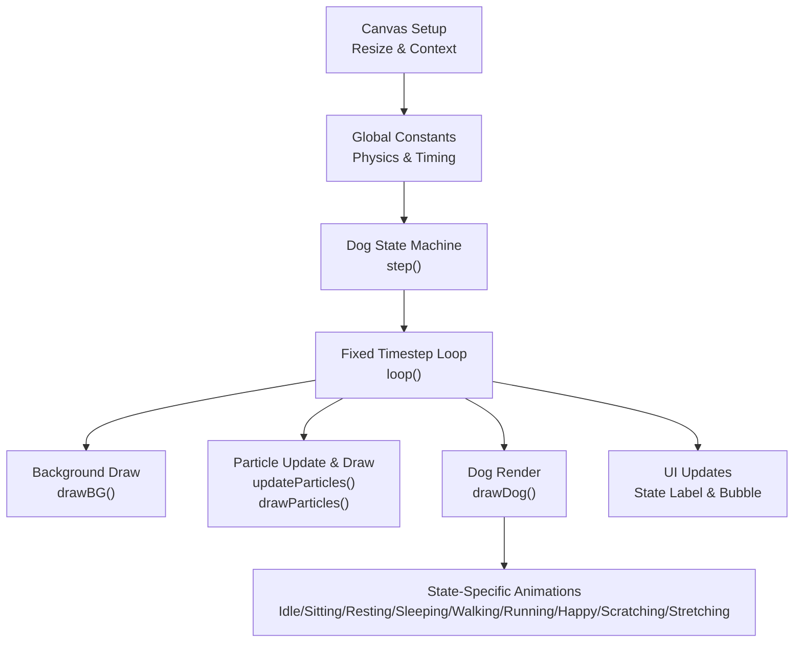
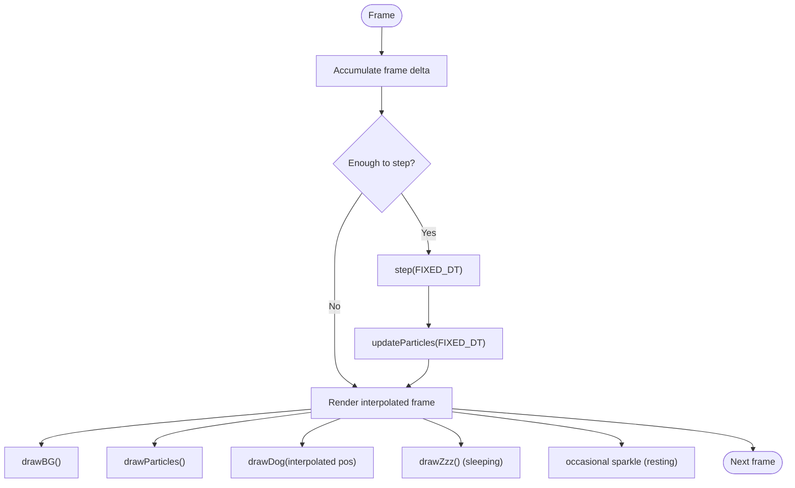
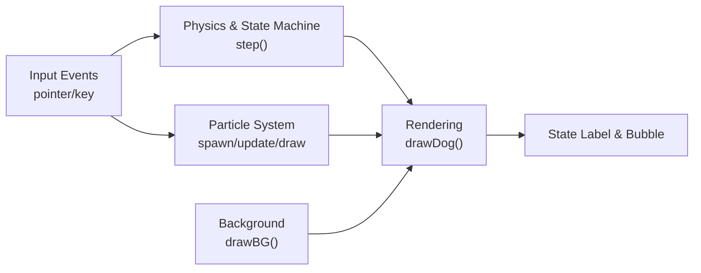

# Customization and Extension Guide

<cite>
**Referenced Files in This Document**
- [bernese-pixel-dog.html](file://bernese-pixel-dog.html)
</cite>

## Table of Contents
1. [Introduction](#introduction)
2. [Project Structure](#project-structure)
3. [Core Components](#core-components)
4. [Architecture Overview](#architecture-overview)
5. [Detailed Component Analysis](#detailed-component-analysis)
6. [Dependency Analysis](#dependency-analysis)
7. [Performance Considerations](#performance-considerations)
8. [Troubleshooting Guide](#troubleshooting-guide)
9. [Conclusion](#conclusion)
10. [Appendices](#appendices)

## Introduction
This guide explains how to customize and extend the Bernese Pixel Dog project. It focuses on:
- Parameter tuning for physics and animation
- Adding new character states and corresponding rendering
- Adding new particle types with spawning and rendering logic
- Extending the background environment with new decorative elements and animation cycles
- Maintaining performance and testing customizations effectively

The project is a single HTML file containing all logic, styles, and scripts. It uses a fixed timestep loop, a simple particle system, and pixel-art-style rendering.

## Project Structure
The project is organized as a single HTML file with embedded CSS and JavaScript. The structure follows a functional approach:
- Canvas setup and resizing
- Global constants and state
- Physics and state machine
- Particle system (spawning, update, render)
- Background environment (sky, sun, clouds, flowers, butterflies)
- Dog drawing routines for multiple states
- Loop with fixed timestep and interpolation
- Event handlers for input and UI updates



**Diagram sources**
- [bernese-pixel-dog.html:45-864](file://bernese-pixel-dog.html#L45-L864)

**Section sources**
- [bernese-pixel-dog.html:45-864](file://bernese-pixel-dog.html#L45-L864)

## Core Components
This section documents the primary systems and their roles.

- Physics and movement
  - Spring force and damping control acceleration toward target position
  - Maximum speed clamps velocity
  - Fixed timestep ensures deterministic simulation
  - State transitions depend on distance to target and speed thresholds

- State machine
  - States include idle, walking, running, sitting, resting, sleeping, happy, scratching, stretching
  - Transitions occur based on elapsed time and activity thresholds
  - Some states trigger periodic behaviors (e.g., paw twitch, scratch duration)

- Particle system
  - Spawns particles with type-specific initial velocities, lifetimes, sizes, rotations
  - Updates positions, gravity/drag, rotation, and life
  - Renders particles with dedicated draw functions

- Background environment
  - Sky gradient, sun with animated rays
  - Moving clouds
  - Animated flowers with swaying stems and rotating petals
  - Butterflies with oscillating wing motion

- Rendering pipeline
  - Background drawn first
  - Particles drawn next
  - Dog drawn last
  - Sleep visuals and occasional sparkles rendered conditionally

**Section sources**
- [bernese-pixel-dog.html:61-715](file://bernese-pixel-dog.html#L61-L715)
- [bernese-pixel-dog.html:717-794](file://bernese-pixel-dog.html#L717-L794)
- [bernese-pixel-dog.html:557-634](file://bernese-pixel-dog.html#L557-L634)

## Architecture Overview
The runtime architecture combines fixed-time stepping with interpolation for smooth rendering.

```mermaid
sequenceDiagram
participant RAF as "requestAnimationFrame"
participant Loop as "loop()"
participant Step as "step(dt)"
participant PartUpd as "updateParticles(dt)"
participant BG as "drawBG()"
participant PartDraw as "drawParticles()"
participant Dog as "drawDog()"
participant UI as "State Label & Bubble"
RAF->>Loop : "frame"
Loop->>Loop : "compute frame delta"
Loop->>Loop : "accumulate to FIXED_DT"
Loop->>Step : "step(FIXED_DT)"
Loop->>PartUpd : "updateParticles(FIXED_DT)"
Loop->>BG : "drawBG()"
Loop->>PartDraw : "drawParticles()"
Loop->>Dog : "drawDog(interpolated pos)"
Loop->>UI : "update state label & bubble"
Loop-->>RAF : "request next frame"
```

**Diagram sources**
- [bernese-pixel-dog.html:770-794](file://bernese-pixel-dog.html#L770-L794)
- [bernese-pixel-dog.html:636-715](file://bernese-pixel-dog.html#L636-L715)
- [bernese-pixel-dog.html:93-162](file://bernese-pixel-dog.html#L93-L162)
- [bernese-pixel-dog.html:557-634](file://bernese-pixel-dog.html#L557-L634)
- [bernese-pixel-dog.html:257-555](file://bernese-pixel-dog.html#L257-L555)

## Detailed Component Analysis

### Physics and Animation Parameters
Key tunable constants and timing parameters:
- SPRING: spring constant for acceleration toward target
- DAMPING: damping factor for velocity decay
- MAX_SPEED: cap on velocity magnitude
- FIXED_DT: fixed timestep for deterministic simulation
- Animation speed scaling: derived from actual speed relative to MAX_SPEED

Practical effects:
- Higher SPRING increases responsiveness to pointer movement
- Higher DAMPING reduces overshoot and stabilizes movement
- MAX_SPEED controls maximum movement speed
- FIXED_DT affects stability and smoothness; smaller values increase fidelity but cost CPU

Guidelines:
- Tune SPRING and DAMPING together to achieve desired feel
- Increase MAX_SPEED for faster movement; adjust animation rates accordingly
- Keep FIXED_DT small enough to avoid jitter but large enough to remain performant

Example modification locations:
- [Constants and global state:59-73](file://bernese-pixel-dog.html#L59-L73)
- [Physics update and state transitions:636-715](file://bernese-pixel-dog.html#L636-L715)

**Section sources**
- [bernese-pixel-dog.html:61-715](file://bernese-pixel-dog.html#L61-L715)

### Adding a New Character State
Steps to add a new state (e.g., “playful”):
1. Extend the state machine
   - Add a new state name to the state checks and transitions
   - Define behavior in the state selection logic
   - Example reference: [State checks and transitions:257-302](file://bernese-pixel-dog.html#L257-L302)

2. Implement state-specific animations
   - Add new animation variables to the dog object (e.g., playfulTwist)
   - Compute state-specific motion in the draw routine
   - Example reference: [Idle/sitting/resting/sleeping/happy/scratching/stretching branches:257-555](file://bernese-pixel-dog.html#L257-L555)

3. Integrate with input
   - Trigger the state from pointer or keyboard events
   - Example reference: [Pointer and keyboard event handlers:796-850](file://bernese-pixel-dog.html#L796-L850)

4. Optional: Add periodic behaviors
   - Use timers or phase accumulators similar to existing states
   - Example reference: [Scratch and stretch timers:677-691](file://bernese-pixel-dog.html#L677-L691)

5. Update UI
   - Reflect the new state in the label
   - Example reference: [State label update:713-715](file://bernese-pixel-dog.html#L713-L715)

Example modification locations:
- [Dog state machine and transitions:636-715](file://bernese-pixel-dog.html#L636-L715)
- [Dog drawing logic for states:257-555](file://bernese-pixel-dog.html#L257-L555)
- [Event handlers:796-850](file://bernese-pixel-dog.html#L796-L850)

**Section sources**
- [bernese-pixel-dog.html:257-555](file://bernese-pixel-dog.html#L257-L555)
- [bernese-pixel-dog.html:636-715](file://bernese-pixel-dog.html#L636-L715)
- [bernese-pixel-dog.html:796-850](file://bernese-pixel-dog.html#L796-L850)

### Adding a New Particle Type
Steps to add a new particle type (e.g., “bubble”):
1. Extend spawning logic
   - Add a new branch in the spawn function to set type-specific initial properties
   - Example reference: [Spawn function:80-91](file://bernese-pixel-dog.html#L80-L91)

2. Implement update logic
   - Add type-specific acceleration/velocity changes in the update loop
   - Example reference: [Particle update loop:93-104](file://bernese-pixel-dog.html#L93-L104)

3. Implement rendering
   - Add a new draw function following the pattern of existing pixel-art renders
   - Example reference: [Existing draw functions:106-162](file://bernese-pixel-dog.html#L106-L162)

4. Integrate drawing
   - Add a new branch in the drawParticles dispatcher
   - Example reference: [Particle drawing dispatcher:145-162](file://bernese-pixel-dog.html#L145-L162)

5. Trigger spawning
   - Call spawnParticle with the new type from appropriate places (e.g., state-specific logic)
   - Example reference: [Heart and sparkle spawning:809-841](file://bernese-pixel-dog.html#L809-L841)

Example modification locations:
- [Spawn function:80-91](file://bernese-pixel-dog.html#L80-L91)
- [Particle update loop:93-104](file://bernese-pixel-dog.html#L93-L104)
- [Particle drawing dispatcher:145-162](file://bernese-pixel-dog.html#L145-L162)
- [Existing draw functions:106-162](file://bernese-pixel-dog.html#L106-L162)

**Section sources**
- [bernese-pixel-dog.html:80-162](file://bernese-pixel-dog.html#L80-L162)
- [bernese-pixel-dog.html:781-786](file://bernese-pixel-dog.html#L781-L786)

### Extending the Background Environment
Steps to add new decorative elements:
1. Add data structures
   - Create arrays for new elements (e.g., trees, birds)
   - Initialize positions, phases, speeds, and colors
   - Example reference: [Flowers and butterflies initialization:203-229](file://bernese-pixel-dog.html#L203-L229)

2. Animate elements
   - Use time-based phases and sinusoidal motion
   - Example reference: [Flower sway and butterfly motion:598-633](file://bernese-pixel-dog.html#L598-L633)

3. Draw elements
   - Implement drawing routines following the existing pixel-art style
   - Example reference: [Background drawing:557-634](file://bernese-pixel-dog.html#L557-L634)

4. Integrate into drawBG
   - Add drawing calls in the background loop
   - Example reference: [Background loop:557-634](file://bernese-pixel-dog.html#L557-634)

Example modification locations:
- [Flowers and butterflies initialization:203-229](file://bernese-pixel-dog.html#L203-L229)
- [Background drawing:557-634](file://bernese-pixel-dog.html#L557-L634)

**Section sources**
- [bernese-pixel-dog.html:203-229](file://bernese-pixel-dog.html#L203-L229)
- [bernese-pixel-dog.html:557-634](file://bernese-pixel-dog.html#L557-L634)

### Rendering Pipeline and Interpolation
The renderer draws in order: background, particles, dog, sleep visuals, and UI. Interpolation smooths the dog’s motion between fixed steps.



**Diagram sources**
- [bernese-pixel-dog.html:770-794](file://bernese-pixel-dog.html#L770-L794)
- [bernese-pixel-dog.html:636-715](file://bernese-pixel-dog.html#L636-L715)
- [bernese-pixel-dog.html:93-162](file://bernese-pixel-dog.html#L93-L162)
- [bernese-pixel-dog.html:557-634](file://bernese-pixel-dog.html#L557-L634)
- [bernese-pixel-dog.html:735-768](file://bernese-pixel-dog.html#L735-L768)

## Dependency Analysis
The system exhibits tight coupling between:
- Physics and state machine (position, velocity, state transitions)
- State machine and rendering (state-dependent draw branches)
- Particle system and rendering (dispatch by type)
- Background and time (time-based phases)



**Diagram sources**
- [bernese-pixel-dog.html:636-715](file://bernese-pixel-dog.html#L636-L715)
- [bernese-pixel-dog.html:257-555](file://bernese-pixel-dog.html#L257-L555)
- [bernese-pixel-dog.html:93-162](file://bernese-pixel-dog.html#L93-L162)
- [bernese-pixel-dog.html:557-634](file://bernese-pixel-dog.html#L557-L634)
- [bernese-pixel-dog.html:796-850](file://bernese-pixel-dog.html#L796-L850)

**Section sources**
- [bernese-pixel-dog.html:636-715](file://bernese-pixel-dog.html#L636-L715)
- [bernese-pixel-dog.html:257-555](file://bernese-pixel-dog.html#L257-L555)
- [bernese-pixel-dog.html:93-162](file://bernese-pixel-dog.html#L93-L162)
- [bernese-pixel-dog.html:557-634](file://bernese-pixel-dog.html#L557-L634)
- [bernese-pixel-dog.html:796-850](file://bernese-pixel-dog.html#L796-L850)

## Performance Considerations
- Fixed timestep loop
  - Ensures deterministic physics and consistent animation
  - Accumulates frame deltas and steps deterministically
  - Reference: [Loop and accumulation:770-773](file://bernese-pixel-dog.html#L770-L773)

- Particle lifecycle
  - Remove dead particles immediately to keep arrays small
  - Reference: [Particle removal](file://bernese-pixel-dog.html#L102)

- Conditional rendering
  - Only draw sleep visuals and occasional sparkles when relevant
  - Reference: [Conditional sleep visuals and sparkles:781-786](file://bernese-pixel-dog.html#L781-L786)

- Minimize allocations
  - Reuse arrays and avoid frequent object creation in loops
  - Reference: [Particle array usage:79-91](file://bernese-pixel-dog.html#L79-L91)

- Time-based phases
  - Use accumulated time to avoid per-frame computations where possible
  - Reference: [Time-based phases:587-633](file://bernese-pixel-dog.html#L587-L633)

[No sources needed since this section provides general guidance]

## Troubleshooting Guide
Common issues and resolutions:
- Dog does not move
  - Ensure pointer movement updates target position and triggers state change
  - References: [Pointer move handler:796-802](file://bernese-pixel-dog.html#L796-L802), [State transitions:636-692](file://bernese-pixel-dog.html#L636-L692)

- Particles not appearing
  - Verify spawn calls and type dispatch in drawParticles
  - References: [Spawn calls:809-841](file://bernese-pixel-dog.html#L809-L841), [Particle dispatch:145-162](file://bernese-pixel-dog.html#L145-L162)

- Background elements not animating
  - Confirm time-based phases and draw calls are active
  - References: [Background loop:557-634](file://bernese-pixel-dog.html#L557-L634)

- State label not updating
  - Check state label update in the loop
  - Reference: [State label update:713-715](file://bernese-pixel-dog.html#L713-L715)

**Section sources**
- [bernese-pixel-dog.html:796-850](file://bernese-pixel-dog.html#L796-L850)
- [bernese-pixel-dog.html:636-715](file://bernese-pixel-dog.html#L636-L715)
- [bernese-pixel-dog.html:557-634](file://bernese-pixel-dog.html#L557-L634)
- [bernese-pixel-dog.html:145-162](file://bernese-pixel-dog.html#L145-L162)

## Conclusion
This guide outlined how to tune physics and animation, add new states and particle types, and extend the background environment while preserving performance. By following the established patterns—fixed timestep, deterministic state transitions, and pixel-art rendering—you can safely integrate new features without disrupting the existing system.

[No sources needed since this section summarizes without analyzing specific files]

## Appendices

### A. Parameter Tuning Examples
- Adjust responsiveness
  - Increase SPRING slightly to make the dog chase faster
  - Decrease DAMPING to allow more bounce
  - Reference: [Physics constants](file://bernese-pixel-dog.html#L61)

- Increase movement speed
  - Raise MAX_SPEED to allow faster traversal
  - Reference: [Max speed usage](file://bernese-pixel-dog.html#L646)

- Modify animation timing
  - Change the rate calculation for walking/running phases
  - Reference: [Animation rate:699-703](file://bernese-pixel-dog.html#L699-L703)

**Section sources**
- [bernese-pixel-dog.html:61](file://bernese-pixel-dog.html#L61)
- [bernese-pixel-dog.html:646](file://bernese-pixel-dog.html#L646)
- [bernese-pixel-dog.html:699-703](file://bernese-pixel-dog.html#L699-L703)

### B. Adding a New State: Step-by-Step
- Add state name and checks
  - Reference: [State checks:257-302](file://bernese-pixel-dog.html#L257-L302)
- Implement state logic
  - Reference: [State branches:257-555](file://bernese-pixel-dog.html#L257-L555)
- Trigger from input
  - Reference: [Event handlers:796-850](file://bernese-pixel-dog.html#L796-L850)
- Update label
  - Reference: [State label:713-715](file://bernese-pixel-dog.html#L713-L715)

**Section sources**
- [bernese-pixel-dog.html:257-555](file://bernese-pixel-dog.html#L257-L555)
- [bernese-pixel-dog.html:796-850](file://bernese-pixel-dog.html#L796-L850)
- [bernese-pixel-dog.html:713-715](file://bernese-pixel-dog.html#L713-L715)

### C. Adding a New Particle Type: Step-by-Step
- Add spawn logic
  - Reference: [Spawn function:80-91](file://bernese-pixel-dog.html#L80-L91)
- Add update logic
  - Reference: [Particle update:93-104](file://bernese-pixel-dog.html#L93-L104)
- Add draw function
  - Reference: [Existing draw functions:106-162](file://bernese-pixel-dog.html#L106-L162)
- Dispatch in drawParticles
  - Reference: [Particle dispatch:145-162](file://bernese-pixel-dog.html#L145-L162)
- Trigger spawning
  - Reference: [Spawn calls:809-841](file://bernese-pixel-dog.html#L809-L841)

**Section sources**
- [bernese-pixel-dog.html:80-162](file://bernese-pixel-dog.html#L80-L162)
- [bernese-pixel-dog.html:781-786](file://bernese-pixel-dog.html#L781-L786)

### D. Extending the Background: Step-by-Step
- Initialize new elements
  - Reference: [Flowers/butterflies init:203-229](file://bernese-pixel-dog.html#L203-L229)
- Animate with time
  - Reference: [Background animation:587-633](file://bernese-pixel-dog.html#L587-L633)
- Draw elements
  - Reference: [Background draw:557-634](file://bernese-pixel-dog.html#L557-L634)

**Section sources**
- [bernese-pixel-dog.html:203-229](file://bernese-pixel-dog.html#L203-L229)
- [bernese-pixel-dog.html:557-634](file://bernese-pixel-dog.html#L557-L634)