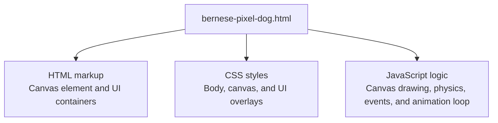
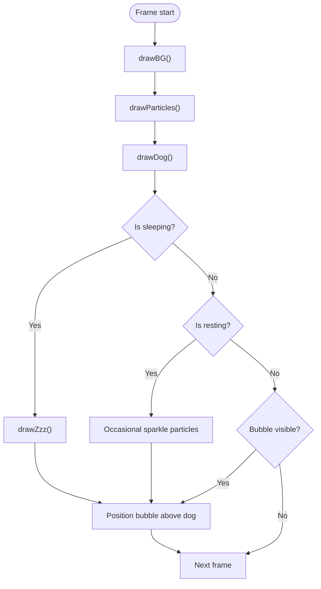
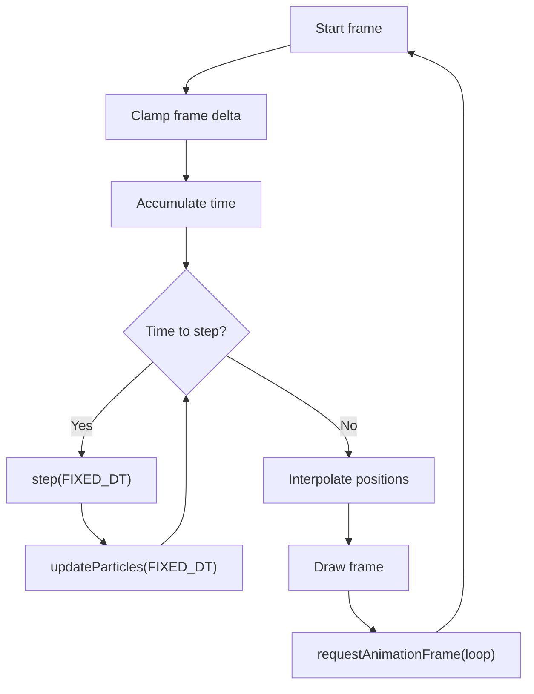
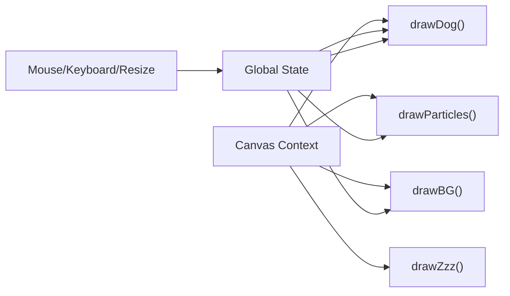

# Getting Started

<cite>
**Referenced Files in This Document**
- [bernese-pixel-dog.html](file://bernese-pixel-dog.html)
</cite>

## Table of Contents
1. [Introduction](#introduction)
2. [Project Structure](#project-structure)
3. [Core Components](#core-components)
4. [Architecture Overview](#architecture-overview)
5. [Detailed Component Analysis](#detailed-component-analysis)
6. [Dependency Analysis](#dependency-analysis)
7. [Performance Considerations](#performance-considerations)
8. [Troubleshooting Guide](#troubleshooting-guide)
9. [Conclusion](#conclusion)

## Introduction
Bernese Pixel Dog is a self-contained HTML application that renders a pixel-art dog character on an HTML5 Canvas. It runs entirely in the browser without external dependencies. You can open the HTML file directly in any modern browser to enjoy interactive animations and playful behaviors.

Key highlights:
- Runs locally from a single HTML file
- Uses HTML5 Canvas for pixel-perfect rendering
- Fully responsive to window resizing
- Interactive controls via mouse and keyboard

## Project Structure
The project consists of a single HTML file that contains all HTML, CSS, JavaScript, and assets required to run the application.



**Diagram sources**
- [bernese-pixel-dog.html:1-864](file://bernese-pixel-dog.html#L1-L864)

**Section sources**
- [bernese-pixel-dog.html:1-864](file://bernese-pixel-dog.html#L1-L864)

## Core Components
- Canvas rendering surface: The primary drawing area for the scene and the dog character.
- UI overlays:
  - Speech bubble: Appears when the dog reacts to interactions.
  - State label: Displays the current behavior (e.g., IDLE, HAPPY, SLEEPING).
- Interactive event handlers: Mouse movement, clicks, keyboard input (spacebar, S key), and window resize.

How to run locally:
- Save the HTML file to your computer.
- Double-click the file to open it in your default browser.
- Alternatively, right-click the file and choose “Open with” to select a specific browser.

Browser compatibility:
- Requires a modern browser with HTML5 Canvas support.
- Works on desktop and mobile browsers that support pointer events and keyboard input.

**Section sources**
- [bernese-pixel-dog.html:41-44](file://bernese-pixel-dog.html#L41-L44)
- [bernese-pixel-dog.html:46-57](file://bernese-pixel-dog.html#L46-L57)

## Architecture Overview
The application follows a classic requestAnimationFrame-driven loop with separate concerns for drawing, simulation, and user interaction.

```mermaid
sequenceDiagram
participant Browser as "Browser"
participant Canvas as "Canvas"
participant Loop as "Animation Loop"
participant Events as "Event Handlers"
participant Draw as "Drawing Functions"
Browser->>Canvas : Load HTML and initialize canvas
Browser->>Loop : requestAnimationFrame(loop)
Loop->>Events : Attach listeners (mouse, keyboard, resize)
Loop->>Draw : drawBG(), drawParticles(), drawDog()
Draw-->>Canvas : Render scene
Loop->>Loop : Schedule next frame
Events-->>Loop : Update state (mouse move, click, key press)
```

**Diagram sources**
- [bernese-pixel-dog.html:46-57](file://bernese-pixel-dog.html#L46-L57)
- [bernese-pixel-dog.html:770-794](file://bernese-pixel-dog.html#L770-L794)
- [bernese-pixel-dog.html:796-850](file://bernese-pixel-dog.html#L796-L850)

## Detailed Component Analysis

### Rendering Pipeline
- Background: Sky gradient, sun, clouds, flowers, and butterflies.
- Particles: Heart, sparkle, dust, and dream bone effects.
- Dog: Pixel-art character with multiple states (idle, walking, running, happy, sitting, resting, sleeping, scratching, stretching).
- UI: Speech bubble and state label positioned relative to the dog.



**Diagram sources**
- [bernese-pixel-dog.html:557-634](file://bernese-pixel-dog.html#L557-L634)
- [bernese-pixel-dog.html:145-162](file://bernese-pixel-dog.html#L145-L162)
- [bernese-pixel-dog.html:257-555](file://bernese-pixel-dog.html#L257-L555)
- [bernese-pixel-dog.html:735-768](file://bernese-pixel-dog.html#L735-L768)
- [bernese-pixel-dog.html:770-794](file://bernese-pixel-dog.html#L770-L794)

**Section sources**
- [bernese-pixel-dog.html:557-634](file://bernese-pixel-dog.html#L557-L634)
- [bernese-pixel-dog.html:145-162](file://bernese-pixel-dog.html#L145-L162)
- [bernese-pixel-dog.html:257-555](file://bernese-pixel-dog.html#L257-L555)
- [bernese-pixel-dog.html:735-768](file://bernese-pixel-dog.html#L735-L768)
- [bernese-pixel-dog.html:770-794](file://bernese-pixel-dog.html#L770-L794)

### Physics and Animation Loop
- Fixed-time-step simulation ensures consistent motion across frames.
- Smooth interpolation between previous and current positions for fluid rendering.
- State transitions driven by velocity thresholds and timers.



**Diagram sources**
- [bernese-pixel-dog.html:770-794](file://bernese-pixel-dog.html#L770-L794)
- [bernese-pixel-dog.html:636-715](file://bernese-pixel-dog.html#L636-L715)
- [bernese-pixel-dog.html:93-104](file://bernese-pixel-dog.html#L93-L104)

**Section sources**
- [bernese-pixel-dog.html:770-794](file://bernese-pixel-dog.html#L770-L794)
- [bernese-pixel-dog.html:636-715](file://bernese-pixel-dog.html#L636-L715)
- [bernese-pixel-dog.html:93-104](file://bernese-pixel-dog.html#L93-L104)

### Interactive Features

- Mouse pointer movement:
  - Moves the target position the dog follows.
  - Causes the dog’s eyes to track the pointer.
  - Wakes the dog from sleep/rest/sit/scratch if needed.

- Click anywhere:
  - Instantly sets the dog’s target to the click position.
  - Transitions the dog into a happy state with heart particles and a random bark phrase.
  - Automatically returns to idle after a short duration.

- Press Space bar:
  - Forces the dog into a happy state.
  - Emits a small burst of heart particles and a friendly message.
  - Returns to idle after a short duration.

- Press S key:
  - Transitions the dog into a stretching pose for a few seconds.
  - Displays a stretch message.

- Window resizing:
  - Resizes the canvas to match the viewport.
  - Adjusts background elements (flowers) to fit new dimensions.

```mermaid
sequenceDiagram
participant User as "User"
participant Canvas as "Canvas"
participant Loop as "Animation Loop"
participant Dog as "Dog State"
User->>Canvas : Move mouse
Canvas->>Loop : pointermove event
Loop->>Dog : Update target and look direction
Note over Dog : Dog follows pointer with spring physics
User->>Canvas : Click
Canvas->>Loop : pointerdown event
Loop->>Dog : Set happy state, spawn hearts, show bubble
Loop->>Dog : Reset to idle after timeout
User->>Canvas : Press Space
Canvas->>Loop : keydown event
Loop->>Dog : Set happy state, spawn hearts, show bubble
Loop->>Dog : Reset to idle after timeout
User->>Canvas : Press S
Canvas->>Loop : keydown event
Loop->>Dog : Set stretching state, show bubble
Loop->>Dog : Reset to idle after timeout
User->>Canvas : Resize window
Canvas->>Loop : resize event
Loop->>Canvas : Resize canvas and adjust background elements
```

**Diagram sources**
- [bernese-pixel-dog.html:796-850](file://bernese-pixel-dog.html#L796-L850)
- [bernese-pixel-dog.html:51-57](file://bernese-pixel-dog.html#L51-L57)
- [bernese-pixel-dog.html:852-858](file://bernese-pixel-dog.html#L852-L858)

**Section sources**
- [bernese-pixel-dog.html:796-850](file://bernese-pixel-dog.html#L796-L850)
- [bernese-pixel-dog.html:51-57](file://bernese-pixel-dog.html#L51-L57)
- [bernese-pixel-dog.html:852-858](file://bernese-pixel-dog.html#L852-L858)

## Dependency Analysis
- Internal dependencies:
  - Drawing functions depend on the canvas context and global state.
  - Event handlers modify state and trigger immediate visual updates.
  - Animation loop coordinates drawing and state updates.

- External dependencies:
  - None. The entire application is self-contained in a single HTML file.



**Diagram sources**
- [bernese-pixel-dog.html:46-49](file://bernese-pixel-dog.html#L46-L49)
- [bernese-pixel-dog.html:557-634](file://bernese-pixel-dog.html#L557-L634)
- [bernese-pixel-dog.html:145-162](file://bernese-pixel-dog.html#L145-L162)
- [bernese-pixel-dog.html:257-555](file://bernese-pixel-dog.html#L257-L555)
- [bernese-pixel-dog.html:735-768](file://bernese-pixel-dog.html#L735-L768)

**Section sources**
- [bernese-pixel-dog.html:46-49](file://bernese-pixel-dog.html#L46-L49)
- [bernese-pixel-dog.html:557-634](file://bernese-pixel-dog.html#L557-L634)
- [bernese-pixel-dog.html:145-162](file://bernese-pixel-dog.html#L145-L162)
- [bernese-pixel-dog.html:257-555](file://bernese-pixel-dog.html#L257-L555)
- [bernese-pixel-dog.html:735-768](file://bernese-pixel-dog.html#L735-L768)

## Performance Considerations
- Fixed-time-step loop: Ensures stable animation regardless of frame rate.
- Frame clamping: Limits excessive deltas to prevent large jumps.
- Efficient drawing: Uses pixel-aligned rectangles and minimal transforms.
- Particle lifecycle: Removes dead particles to keep memory usage low.
- Responsive canvas: Automatically scales to the window size.

Tips:
- Close other tabs to reduce CPU/GPU load.
- Use a recent browser for optimal performance.
- On lower-end devices, expect smoother performance at smaller window sizes.

**Section sources**
- [bernese-pixel-dog.html:770-794](file://bernese-pixel-dog.html#L770-L794)
- [bernese-pixel-dog.html:93-104](file://bernese-pixel-dog.html#L93-L104)
- [bernese-pixel-dog.html:51-57](file://bernese-pixel-dog.html#L51-L57)

## Troubleshooting Guide

Common issues and resolutions:
- Canvas does not render:
  - Ensure you are opening the file in a modern browser that supports HTML5 Canvas.
  - Try refreshing the page or clearing the browser cache.
  - Verify the file was downloaded completely and is not corrupted.

- Dog does not respond to mouse or keys:
  - Confirm the mouse pointer is inside the browser window.
  - Ensure the browser tab is active (some behaviors pause when the tab loses focus).
  - Try clicking once to wake the dog if it is sleeping or resting.

- Performance feels sluggish:
  - Close other browser tabs and applications.
  - Resize the browser window to a smaller size.
  - Use a different browser if performance improves.

- Visual artifacts or blurry rendering:
  - The application uses pixelated rendering mode for crisp pixels.
  - If your browser zoom level is not 100%, reset zoom to 100%.

- Stretch or happy states do not appear:
  - Press the S key for stretching and Space bar for extra happiness.
  - Ensure the key is not blocked by another application or browser extension.

**Section sources**
- [bernese-pixel-dog.html:796-850](file://bernese-pixel-dog.html#L796-L850)
- [bernese-pixel-dog.html:824-832](file://bernese-pixel-dog.html#L824-L832)

## Conclusion
You are ready to play with Bernese Pixel Dog! Open the HTML file in your browser, move the mouse to make the dog follow, click to make it happy, press Space for extra happiness, press S for a stretch, and resize the window to see the responsive scene adapt. Enjoy the pixel-perfect fun and feel free to explore the interactive features described above.