# Interactive Features

<cite>
**Referenced Files in This Document**
- [bernese-pixel-dog.html](file://bernese-pixel-dog.html)
</cite>

## Table of Contents
1. [Introduction](#introduction)
2. [Mouse Interaction Processing](#mouse-interaction-processing)
3. [Keyboard Control Implementation](#keyboard-control-implementation)
4. [Event-Driven Programming Patterns](#event-driven-programming-patterns)
5. [State Management System](#state-management-system)
6. [Physics-Based Movement](#physics-based-movement)
7. [Responsive Design Implementation](#responsive-design-implementation)
8. [Common Interaction Scenarios](#common-interaction-scenarios)
9. [Performance Considerations](#performance-considerations)
10. [Troubleshooting Guide](#troubleshooting-guide)

## Introduction

The Bernese Pixel Dog interactive features demonstrate sophisticated event-driven programming with physics-based animations and responsive design. This implementation showcases modern web technologies including Canvas rendering, DOM event handling, and smooth animation loops with pixel-perfect graphics.

The interactive system centers around a pixel-art dog character that responds to user input through mouse and keyboard controls, transitioning between various emotional and physical states with realistic physics simulation.

## Mouse Interaction Processing

### Pointer Movement Tracking

The mouse interaction system implements continuous pointer tracking with immediate character following behavior:

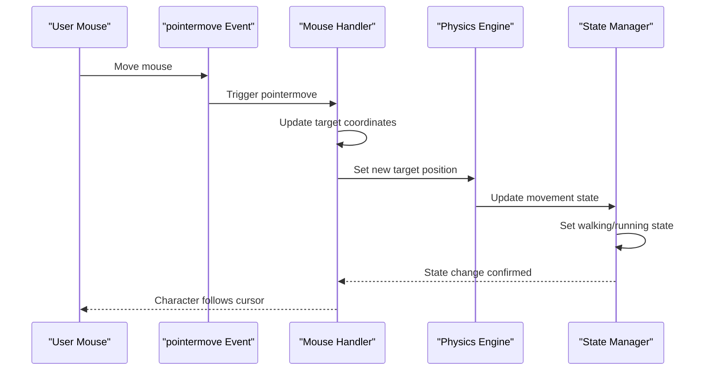

**Diagram sources**
- [bernese-pixel-dog.html:796-802](file://bernese-pixel-dog.html#L796-L802)
- [bernese-pixel-dog.html:636-715](file://bernese-pixel-dog.html#L636-L715)

The pointermove event handler continuously updates the character's target position (`dog.tx`, `dog.ty`) and mouse coordinates (`mouseX`, `mouseY`). This creates immediate visual following behavior where the character smoothly tracks the cursor position using spring-damper physics.

**Section sources**
- [bernese-pixel-dog.html:796-802](file://bernese-pixel-dog.html#L796-L802)
- [bernese-pixel-dog.html:636-715](file://bernese-pixel-dog.html#L636-L715)

### Pointer Down Happiness Reactions

The pointerdown event transforms the character into an excited, happy state with visual feedback:

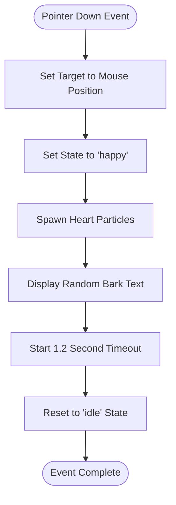

**Diagram sources**
- [bernese-pixel-dog.html:803-822](file://bernese-pixel-dog.html#L803-L822)

The pointerdown handler immediately sets the character to happy state, generates heart-shaped particle effects, displays random bark text in speech bubbles, and automatically transitions back to idle after 1.2 seconds.

**Section sources**
- [bernese-pixel-dog.html:803-822](file://bernese-pixel-dog.html#L803-L822)

### Mouse Leave State Reset

The mouseleave event ensures graceful state transitions when the user moves away from the browser window:

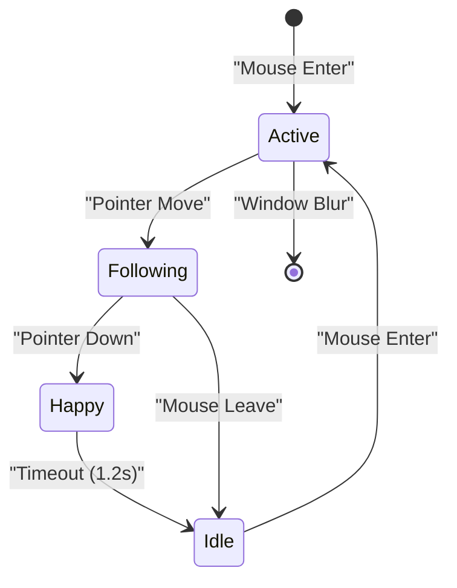

**Diagram sources**
- [bernese-pixel-dog.html:824-832](file://bernese-pixel-dog.html#L824-L832)

The mouseleave handler stops all movement by setting `isOnScreen = false` and resetting velocity vectors, while also transitioning active movement states back to idle.

**Section sources**
- [bernese-pixel-dog.html:824-832](file://bernese-pixel-dog.html#L824-L832)

## Keyboard Control Implementation

### Space Bar Activation

The space bar provides keyboard activation with identical behavior to pointerdown events:

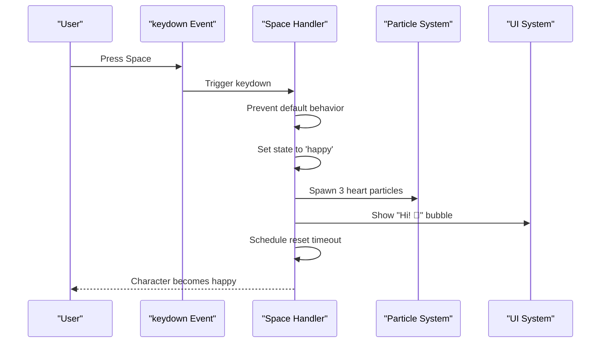

**Diagram sources**
- [bernese-pixel-dog.html:834-843](file://bernese-pixel-dog.html#L834-L843)

The space bar handler prevents default browser scrolling behavior, immediately sets the happy state, spawns heart particles, displays a friendly message bubble, and schedules automatic state reset.

**Section sources**
- [bernese-pixel-dog.html:834-843](file://bernese-pixel-dog.html#L834-L843)

### S Key Stretching Pose

The S key activates a unique stretching animation sequence:

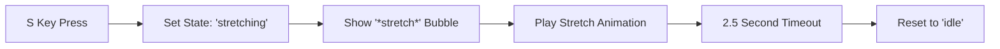

**Diagram sources**
- [bernese-pixel-dog.html:844-849](file://bernese-pixel-dog.html#L844-L849)

The S key handler transitions the character into a dynamic stretching pose with visual feedback, displaying a stretch message and automatically reverting to idle after 2.5 seconds.

**Section sources**
- [bernese-pixel-dog.html:844-849](file://bernese-pixel-dog.html#L844-L849)

## Event-Driven Programming Patterns

### DOM Event Listener Architecture

The application employs a clean separation of concerns through dedicated event handlers:

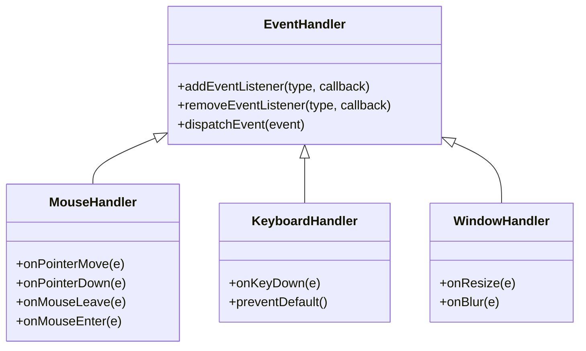

**Diagram sources**
- [bernese-pixel-dog.html:796-858](file://bernese-pixel-dog.html#L796-L858)

Each interaction type has its own specialized handler with focused responsibilities, promoting maintainability and testability.

**Section sources**
- [bernese-pixel-dog.html:796-858](file://bernese-pixel-dog.html#L796-L858)

### State Update Coordination

The event handlers coordinate with the central state management system:

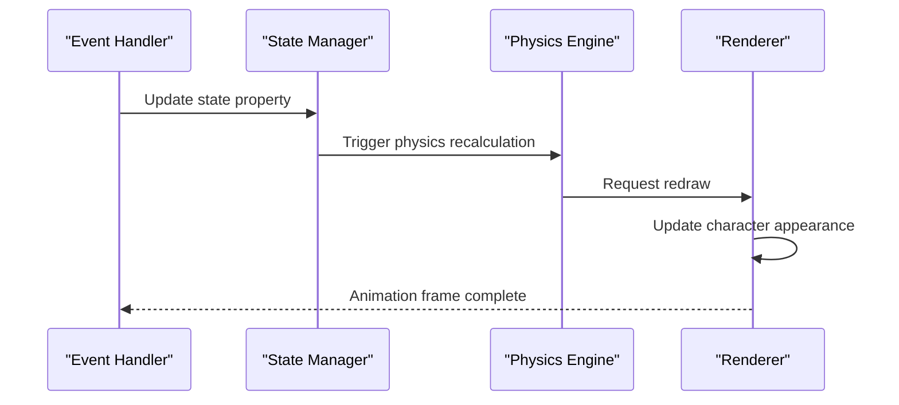

**Diagram sources**
- [bernese-pixel-dog.html:636-715](file://bernese-pixel-dog.html#L636-L715)

**Section sources**
- [bernese-pixel-dog.html:636-715](file://bernese-pixel-dog.html#L636-L715)

## State Management System

### Character State Transitions

The character maintains a comprehensive state machine with smooth transitions:

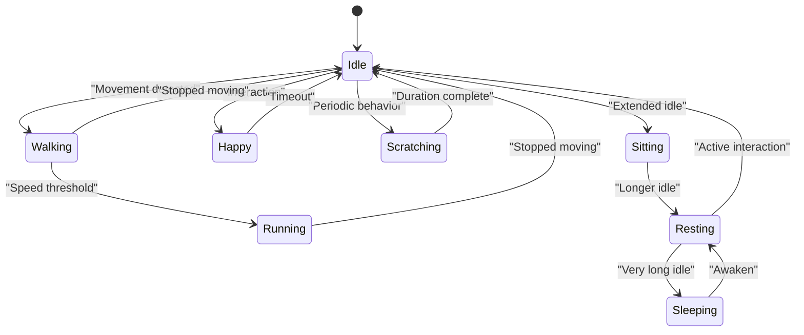

**Diagram sources**
- [bernese-pixel-dog.html:636-715](file://bernese-pixel-dog.html#L636-L715)

The state system implements gradual transitions with timing thresholds, ensuring natural character behavior patterns.

**Section sources**
- [bernese-pixel-dog.html:636-715](file://bernese-pixel-dog.html#L636-L715)

### Physics-Based Movement States

Different states trigger distinct physics behaviors:

| State | Physics Behavior | Visual Effects | Particle Effects |
|-------|------------------|----------------|------------------|
| Idle | Spring-damper to center | Gentle bobbing | None |
| Walking | Spring-damper with gait | Side-to-side movement | Occasional dust |
| Running | Higher spring force | Rapid gait animation | Frequent dust |
| Happy | Elastic spring with bounce | Bouncing and wagging | Heart particles |
| Scratching | Fixed sitting pose | Leg lifting animation | None |
| Stretching | Dynamic pose morphing | Full-body extension | None |
| Sleeping | Minimal movement | ZZZ particles | Dream bubbles |

**Section sources**
- [bernese-pixel-dog.html:636-715](file://bernese-pixel-dog.html#L636-L715)

## Physics-Based Movement

### Spring-Damper System

The character movement utilizes a sophisticated spring-damper physics model:

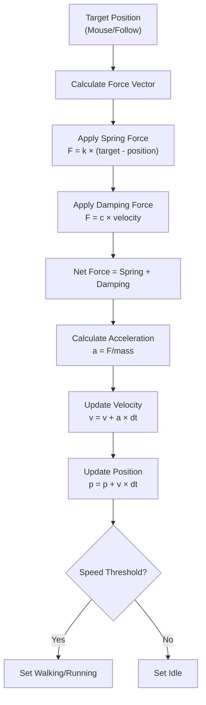

**Diagram sources**
- [bernese-pixel-dog.html:636-715](file://bernese-pixel-dog.html#L636-L715)

The physics system includes configurable spring constants, damping ratios, and maximum speed limits to create natural movement dynamics.

**Section sources**
- [bernese-pixel-dog.html:636-715](file://bernese-pixel-dog.html#L636-L715)

### Animation Frame Integration

The physics engine integrates seamlessly with the animation loop:

```mermaid
sequenceDiagram
participant RAF as "requestAnimationFrame"
participant Loop as "Animation Loop"
participant Physics as "Physics Step"
participant Render as "Render Frame"
RAF->>Loop : Call animation callback
Loop->>Loop : Calculate frame delta
Loop->>Physics : Execute fixed-time steps
Physics->>Physics : Update positions/velocities
Physics-->>Loop : Physics state updated
Loop->>Render : Draw current frame
Render-->>RAF : Next frame scheduled
```

**Diagram sources**
- [bernese-pixel-dog.html:770-794](file://bernese-pixel-dog.html#L770-L794)

**Section sources**
- [bernese-pixel-dog.html:770-794](file://bernese-pixel-dog.html#L770-L794)

## Responsive Design Implementation

### Adaptive Canvas Sizing

The application implements comprehensive responsive design through dynamic canvas resizing:

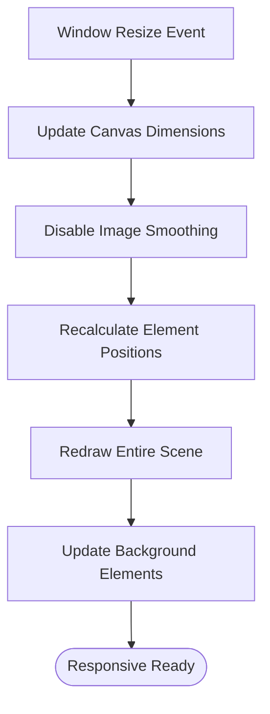

**Diagram sources**
- [bernese-pixel-dog.html:51-57](file://bernese-pixel-dog.html#L51-L57)
- [bernese-pixel-dog.html:852-858](file://bernese-pixel-dog.html#L852-L858)

The resize handler automatically adjusts canvas dimensions to match viewport size while maintaining pixel-perfect rendering quality.

**Section sources**
- [bernese-pixel-dog.html:51-57](file://bernese-pixel-dog.html#L51-L57)
- [bernese-pixel-dog.html:852-858](file://bernese-pixel-dog.html#L852-L858)

### Background Element Adaptation

Background elements dynamically adjust to new screen dimensions:

| Element Type | Adaptation Method | Responsive Behavior |
|--------------|-------------------|---------------------|
| Flowers | Recalculate positions | Randomized within new bounds |
| Butterflies | Update container bounds | Adjusted to new viewport |
| Sky Gradient | Scale to canvas size | Automatically resized |
| Clouds | Recalculate positions | Animated within new bounds |

**Section sources**
- [bernese-pixel-dog.html:204-229](file://bernese-pixel-dog.html#L204-L229)
- [bernese-pixel-dog.html:557-634](file://bernese-pixel-dog.html#L557-L634)

## Common Interaction Scenarios

### Character Following Behavior

When the mouse moves within the viewport, the character immediately begins following with smooth physics-based movement:

**Expected Behavior:**
- Character follows cursor with slight delay
- Walking animation activates at low speeds
- Running animation activates at higher speeds
- Direction flips when crossing center point
- Smooth deceleration when stopping

**Section sources**
- [bernese-pixel-dog.html:796-802](file://bernese-pixel-dog.html#L796-L802)
- [bernese-pixel-dog.html:636-715](file://bernese-pixel-dog.html#L636-L715)

### Happiness Reaction Patterns

Both mouse clicks and space bar presses trigger identical happiness reactions:

**Expected Behavior:**
- Character instantly enters happy state
- Heart particle explosion around character
- Random bark text appears in speech bubble
- Character performs bouncing animation
- Automatic transition back to idle after 1.2 seconds

**Section sources**
- [bernese-pixel-dog.html:803-822](file://bernese-pixel-dog.html#L803-L822)
- [bernese-pixel-dog.html:834-843](file://bernese-pixel-dog.html#L834-L843)

### Stretching Pose Mechanics

The S key activates a unique stretching animation sequence:

**Expected Behavior:**
- Character transitions to stretching pose
- Full-body extension animation plays
- Speech bubble displays "*stretch*" message
- Animation completes in 2.5 seconds
- Automatic return to idle state

**Section sources**
- [bernese-pixel-dog.html:844-849](file://bernese-pixel-dog.html#L844-L849)

### State Transition Timing

The character exhibits natural behavioral patterns through timed state transitions:

**Expected Behavior:**
- Idle state persists indefinitely
- Extended idle (3+ seconds) → Sitting
- Extended sitting (5+ seconds) → Resting  
- Extended resting (8+ seconds) → Sleeping
- Active interactions reset timers
- Scratching occurs periodically during idle/sitting

**Section sources**
- [bernese-pixel-dog.html:662-691](file://bernese-pixel-dog.html#L662-L691)

## Performance Considerations

### Fixed-Time Step Physics

The application implements a robust fixed-time step physics system to ensure consistent behavior across different frame rates:

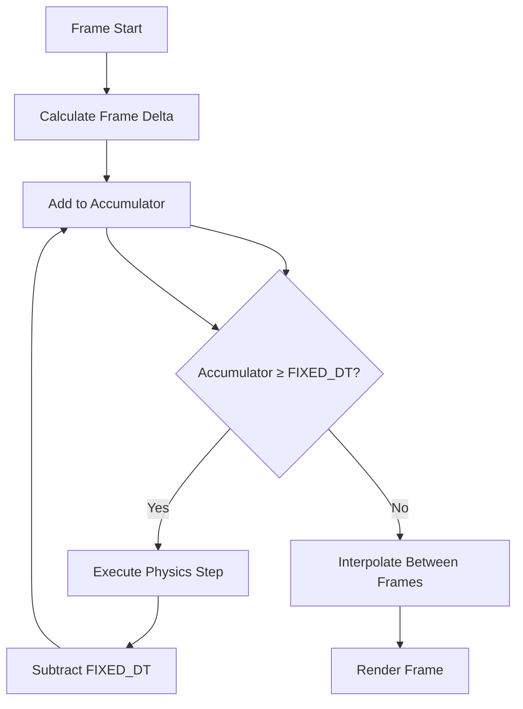

**Diagram sources**
- [bernese-pixel-dog.html:770-794](file://bernese-pixel-dog.html#L770-L794)

### Memory Management

The particle system efficiently manages memory through automatic cleanup:

- Particles are removed when lifespan expires
- Array splicing occurs in reverse order to prevent index issues
- Maximum particle count is implicitly managed by removal logic

**Section sources**
- [bernese-pixel-dog.html:93-104](file://bernese-pixel-dog.html#L93-L104)

### Rendering Optimization

Canvas rendering employs several optimization techniques:

- Pixel smoothing disabled for crisp pixel art
- Efficient rectangle drawing with rounded coordinates
- Conditional rendering based on state
- Optimized animation frame scheduling

**Section sources**
- [bernese-pixel-dog.html:54-55](file://bernese-pixel-dog.html#L54-L55)
- [bernese-pixel-dog.html:200-201](file://bernese-pixel-dog.html#L200-L201)

## Troubleshooting Guide

### Common Interaction Issues

**Problem: Character doesn't follow mouse**
- Verify pointermove event listener is attached
- Check that `isOnScreen` flag remains true
- Ensure mouse coordinates are updating correctly

**Problem: Happiness reaction not triggering**
- Confirm pointerdown event handler is registered
- Verify state transitions aren't being overridden
- Check particle spawning function availability

**Problem: Stretching pose not working**
- Verify S key event handler registration
- Check state transition logic for stretching
- Ensure timeout mechanism is functioning

**Problem: Window resize not updating properly**
- Confirm resize event listener is attached
- Verify canvas dimension updates
- Check background element recalculation

**Section sources**
- [bernese-pixel-dog.html:796-858](file://bernese-pixel-dog.html#L796-L858)

### Performance Optimization Tips

**Memory Leaks Prevention:**
- Ensure event listeners are properly removed if needed
- Monitor particle array growth
- Check for unnecessary DOM manipulations

**Frame Rate Issues:**
- Verify fixed-time step implementation
- Check for heavy computations in render loop
- Monitor particle count during intensive interactions

**Cross-Browser Compatibility:**
- Test pointer event support
- Verify keyboard event code values
- Check canvas rendering differences