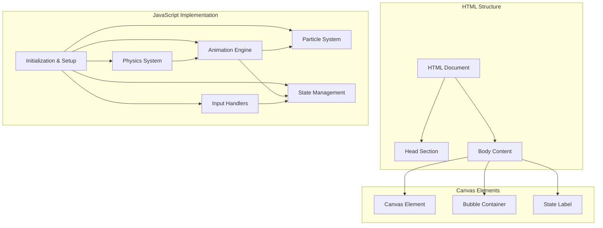
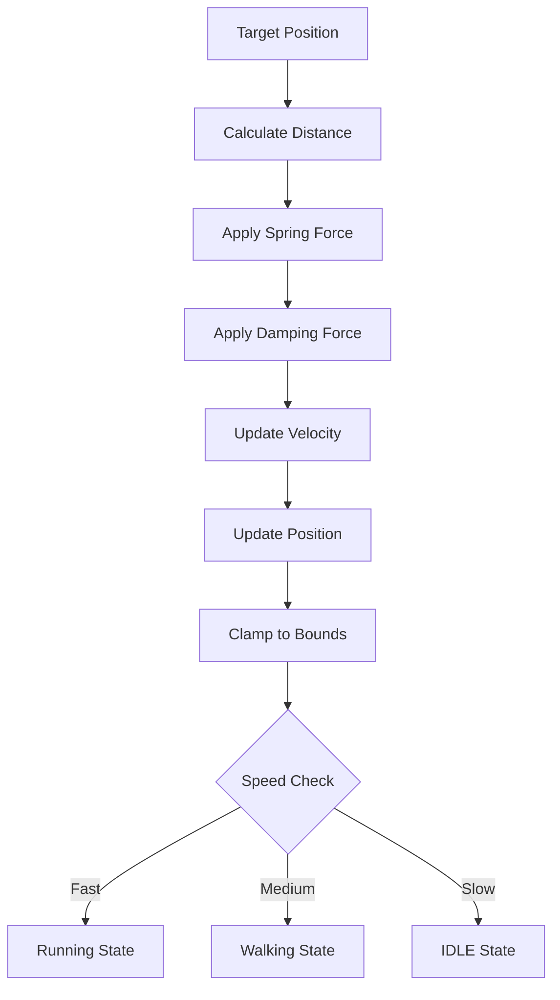
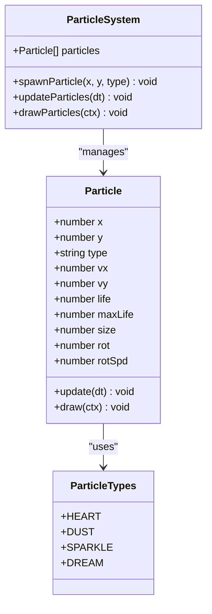
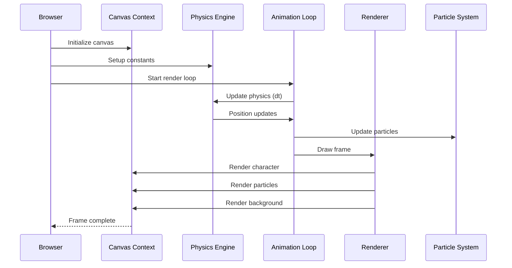
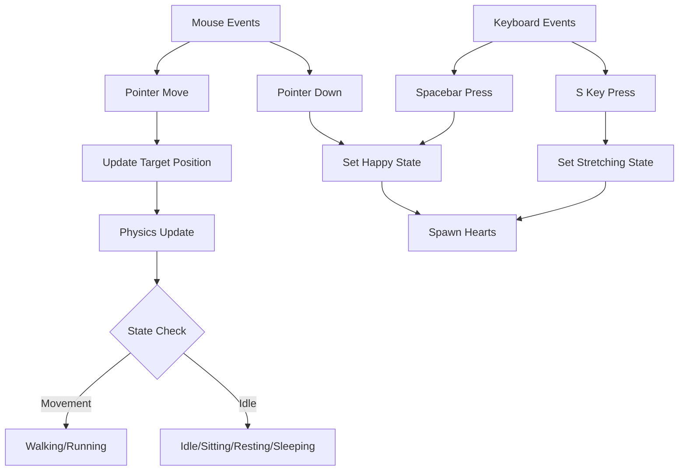
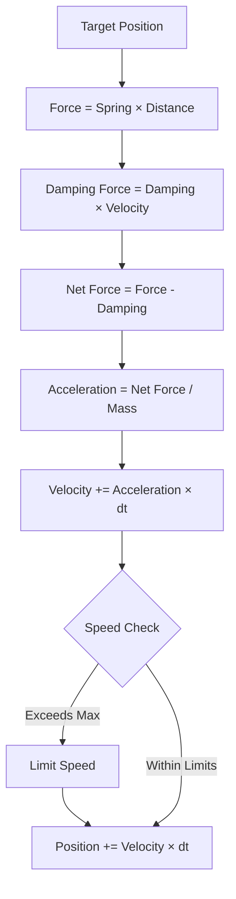
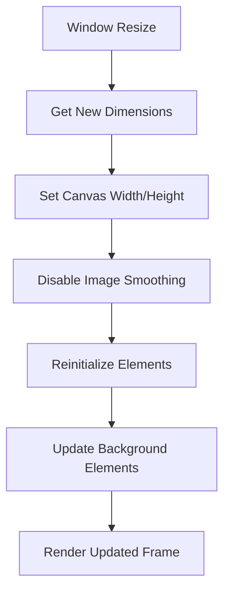
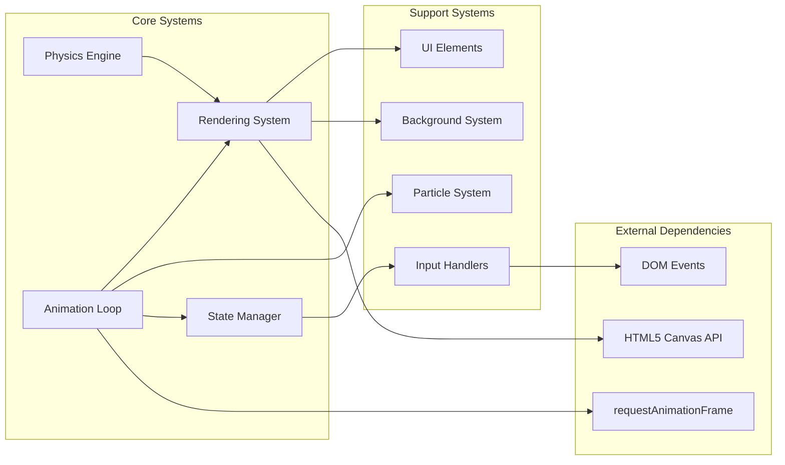

# Project Overview

<cite>
**Referenced Files in This Document**
- [bernese-pixel-dog.html](file://bernese-pixel-dog.html)
</cite>

## Table of Contents
1. [Introduction](#introduction)
2. [Project Structure](#project-structure)
3. [Core Components](#core-components)
4. [Architecture Overview](#architecture-overview)
5. [Detailed Component Analysis](#detailed-component-analysis)
6. [Dependency Analysis](#dependency-analysis)
7. [Performance Considerations](#performance-considerations)
8. [Troubleshooting Guide](#troubleshooting-guide)
9. [Conclusion](#conclusion)

## Introduction

The Bernese Pixel Dog is an interactive HTML5 canvas-based pixel-art character animation that demonstrates advanced animation techniques, physics simulation, and responsive design. This project showcases a complete interactive experience featuring a pixel-art Bernese Mountain Dog character with sophisticated behavioral states, physics-based movement, and particle effects.

The animation system combines several key technologies:
- Pure HTML5 Canvas rendering for pixel-perfect graphics
- Spring-damper physics system for smooth character movement
- State machine architecture with 7 distinct behavioral states
- Particle effects system for environmental interactions
- Responsive design with dynamic canvas sizing
- Interactive controls via mouse and keyboard

## Project Structure

The entire project is contained within a single HTML file that implements all functionality client-side. The structure follows a modular approach with clearly separated concerns:

**Diagram sources**
- [bernese-pixel-dog.html:41-44](file://bernese-pixel-dog.html#L41-L44)
- [bernese-pixel-dog.html:45-58](file://bernese-pixel-dog.html#L45-L58)

**Section sources**
- [bernese-pixel-dog.html:1-864](file://bernese-pixel-dog.html#L1-L864)

## Core Components

### Physics-Based Movement System

The character utilizes a sophisticated spring-damper physics system that creates natural, organic movement patterns:

**Diagram sources**
- [bernese-pixel-dog.html:636-715](file://bernese-pixel-dog.html#L636-L715)

### State Management Architecture

The character operates under a finite state machine with seven distinct behavioral states:

| State | Description | Trigger Conditions |
|-------|-------------|-------------------|
| **Idle** | Character stands still, occasionally tilts head | No movement for extended period |
| **Walking** | Character moves at normal pace | Mouse movement detected |
| **Running** | Character moves quickly with full animation | Fast movement velocity |
| **Sitting** | Character sits down after idle period | Idle timeout reached |
| **Resting** | Character lies down after sitting | Extended idle period |
| **Sleeping** | Character curls up and dreams | Long rest period |
| **Happy** | Character shows excitement with animations | Mouse click or spacebar |
| **Scratching** | Character scratches itself | Idle head tilt trigger |
| **Stretching** | Character stretches after sitting | S key press |

**Section sources**
- [bernese-pixel-dog.html:636-715](file://bernese-pixel-dog.html#L636-L715)
- [bernese-pixel-dog.html:257-555](file://bernese-pixel-dog.html#L257-L555)

### Particle Effects System

The animation includes a comprehensive particle system that responds to character states:

**Diagram sources**
- [bernese-pixel-dog.html:78-104](file://bernese-pixel-dog.html#L78-L104)
- [bernese-pixel-dog.html:145-162](file://bernese-pixel-dog.html#L145-L162)

**Section sources**
- [bernese-pixel-dog.html:78-184](file://bernese-pixel-dog.html#L78-L184)

## Architecture Overview

The animation system follows a hybrid architecture combining immediate mode rendering with retained state management:

**Diagram sources**
- [bernese-pixel-dog.html:770-794](file://bernese-pixel-dog.html#L770-L794)
- [bernese-pixel-dog.html:636-715](file://bernese-pixel-dog.html#L636-L715)

### Input Processing Pipeline

The system handles multiple input sources through a unified event processing system:

**Diagram sources**
- [bernese-pixel-dog.html:796-850](file://bernese-pixel-dog.html#L796-L850)
- [bernese-pixel-dog.html:636-715](file://bernese-pixel-dog.html#L636-L715)

**Section sources**
- [bernese-pixel-dog.html:796-850](file://bernese-pixel-dog.html#L796-L850)

## Detailed Component Analysis

### Spring-Damper Physics System

The physics implementation uses a classic spring-damper model with configurable parameters:

**Spring Constant (SPRING)**: Controls attraction strength toward target position
**Damping Constant (DAMPING)**: Controls resistance to velocity changes  
**Maximum Speed (MAX_SPEED)**: Caps character movement velocity
**Fixed Delta Time (FIXED_DT)**: Ensures consistent physics updates

The system calculates forces using Hooke's law and applies damping proportional to velocity:

**Diagram sources**
- [bernese-pixel-dog.html:636-650](file://bernese-pixel-dog.html#L636-L650)

**Section sources**
- [bernese-pixel-dog.html:61-61](file://bernese-pixel-dog.html#L61-L61)
- [bernese-pixel-dog.html:636-715](file://bernese-pixel-dog.html#L636-L715)

### Character Animation States

Each state implements specific animation patterns and visual effects:

#### Idle State
- Gentle breathing motion
- Subtle ear wiggles
- Occasional head tilts
- Minimal tail wagging

#### Walking State
- Sinusoidal leg movement
- Body bobbing synchronized with stride
- Tail wagging intensity increases with speed
- Ear bounce during movement

#### Running State
- Faster animation cycles
- More pronounced leg swings
- Increased tail wagging amplitude
- Dust particle emission

#### Sitting State
- Character sits with legs positioned
- Reduced animation complexity
- Occasional eye blinks

#### Resting State
- Character lies down
- Extended leg stretches
- Occasional sparkle particles

#### Sleeping State
- Character curls up
- ZZZ dream bubbles
- Paw twitching animations
- Bone and heart dream particles

#### Happy State
- Exaggerated happy animations
- Heart particle bursts
- Blushing cheeks
- Tongue protrusion

#### Scratching State
- One back leg raised
- Intense scratching motion
- Body contortion during scratch

#### Stretching State
- Full-body stretch animation
- Extended limbs
- Dramatic posture change

**Section sources**
- [bernese-pixel-dog.html:257-555](file://bernese-pixel-dog.html#L257-L555)
- [bernese-pixel-dog.html:735-768](file://bernese-pixel-dog.html#L735-L768)

### Particle Effects Implementation

The particle system supports four distinct particle types with unique behaviors:

| Particle Type | Behavior | Emission Conditions | Visual Characteristics |
|---------------|----------|-------------------|----------------------|
| **Heart** | Gravity with upward drift | Happy state, clicks | Pink/red heart shapes |
| **Dust** | Ground-level emission | Running movement | Brown square particles |
| **Sparkle** | Floating upward | Resting state | White star-like particles |
| **Dream** | Bone-shaped particles | Sleep state | Cream-colored bone patterns |

**Section sources**
- [bernese-pixel-dog.html:78-104](file://bernese-pixel-dog.html#L78-L104)
- [bernese-pixel-dog.html:145-184](file://bernese-pixel-dog.html#L145-L184)

### Responsive Design System

The canvas automatically adapts to viewport changes while maintaining pixel-perfect rendering:

**Diagram sources**
- [bernese-pixel-dog.html:51-57](file://bernese-pixel-dog.html#L51-L57)
- [bernese-pixel-dog.html:852-858](file://bernese-pixel-dog.html#L852-L858)

**Section sources**
- [bernese-pixel-dog.html:51-57](file://bernese-pixel-dog.html#L51-L57)
- [bernese-pixel-dog.html:852-858](file://bernese-pixel-dog.html#L852-L858)

## Dependency Analysis

The codebase exhibits excellent modularity with clear separation of concerns:

**Diagram sources**
- [bernese-pixel-dog.html:45-58](file://bernese-pixel-dog.html#L45-L58)
- [bernese-pixel-dog.html:770-794](file://bernese-pixel-dog.html#L770-L794)

### External Dependencies

The project relies on minimal external dependencies:
- **HTML5 Canvas API**: For 2D rendering
- **DOM Events**: For user interaction
- **requestAnimationFrame**: For smooth animation timing
- **CSS3**: For styling and transitions

**Section sources**
- [bernese-pixel-dog.html:45-58](file://bernese-pixel-dog.html#L45-L58)
- [bernese-pixel-dog.html:770-794](file://bernese-pixel-dog.html#L770-L794)

## Performance Considerations

### Frame Rate Optimization

The animation system implements several performance optimization strategies:

**Fixed Time Step**: Uses a constant 1/120 second timestep for physics calculations
**Variable Rendering**: Interpolates between physics updates for smooth visuals
**Efficient Drawing**: Minimizes canvas state changes and uses batch drawing operations
**Selective Updates**: Only updates elements that have changed

### Memory Management

**Particle Pooling**: Reuses particle objects instead of creating new ones
**Array Splicing**: Efficiently removes dead particles from arrays
**Object Properties**: Uses primitive properties for optimal memory usage

### Rendering Efficiency

**Pixel-Perfect Rendering**: Sets canvas to pixelated mode for crisp graphics
**Batch Operations**: Groups drawing operations to minimize state changes
**Conditional Rendering**: Only renders elements relevant to current state

## Troubleshooting Guide

### Common Issues and Solutions

**Character Not Moving**
- Verify mouse movement events are firing
- Check target position updates in pointer move handler
- Ensure physics constants are properly initialized

**State Transitions Not Working**
- Confirm state timers are incrementing correctly
- Verify idle thresholds for state changes
- Check state reset conditions after interactions

**Particle System Issues**
- Ensure particle arrays are properly managed
- Verify particle lifetime calculations
- Check particle type dispatch logic

**Performance Problems**
- Monitor frame rate with browser developer tools
- Check for excessive object creation
- Verify efficient array iteration patterns

### Debugging Techniques

**State Monitoring**: Use the state label element to track current character state
**Physics Debugging**: Temporarily visualize force vectors and velocity
**Particle Debugging**: Add console logs for particle spawning and removal
**Performance Profiling**: Use browser profiling tools to identify bottlenecks

**Section sources**
- [bernese-pixel-dog.html:713-715](file://bernese-pixel-dog.html#L713-L715)
- [bernese-pixel-dog.html:186-198](file://bernese-pixel-dog.html#L186-L198)

## Conclusion

The Bernese Pixel Dog interactive animation project demonstrates sophisticated implementation of modern web technologies in a single HTML file. It successfully combines physics simulation, state management, particle effects, and responsive design to create an engaging interactive experience.

Key achievements include:
- **Complete Self-Containment**: All functionality in a single HTML file
- **Advanced Physics**: Realistic spring-damper system with proper constraints
- **Rich Animation**: Seven distinct behavioral states with detailed animations
- **Interactive Design**: Multiple input methods with immediate feedback
- **Performance Optimization**: Efficient rendering and memory management
- **Responsive Architecture**: Dynamic adaptation to various screen sizes

The project serves as an excellent example of modern web development practices, showcasing how complex interactive experiences can be built using pure HTML5 technologies without external dependencies.