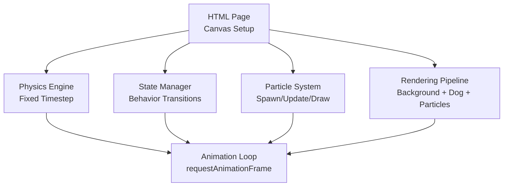
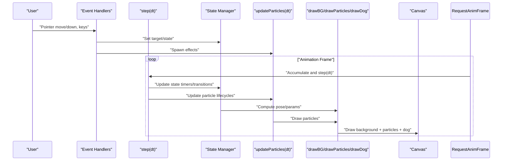
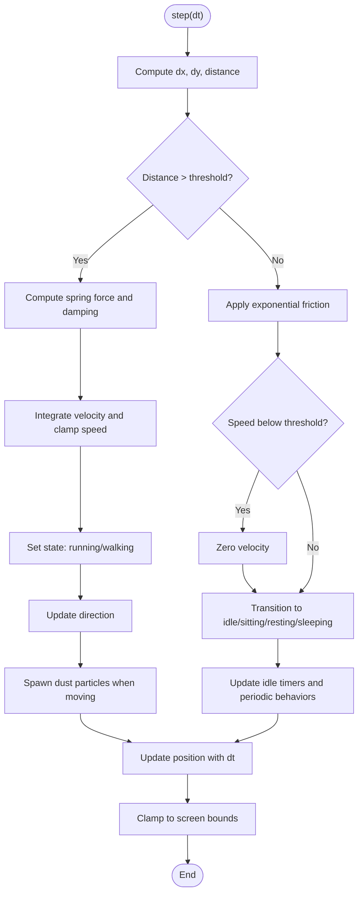
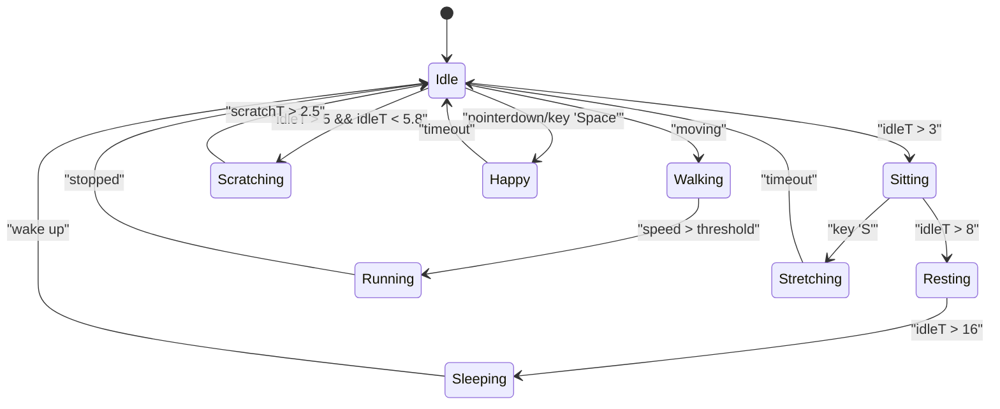
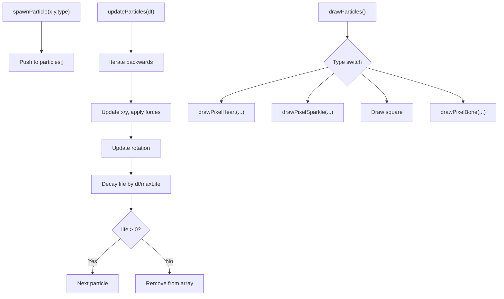
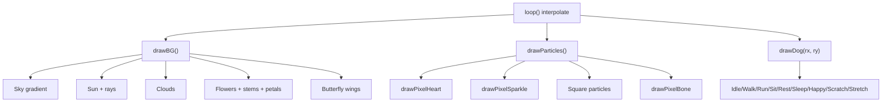
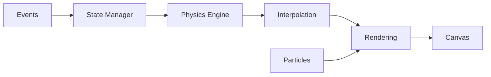

# Technical Architecture

<cite>
**Referenced Files in This Document**
- [bernese-pixel-dog.html](file://bernese-pixel-dog.html)
</cite>

## Table of Contents
1. [Introduction](#introduction)
2. [Project Structure](#project-structure)
3. [Core Components](#core-components)
4. [Architecture Overview](#architecture-overview)
5. [Detailed Component Analysis](#detailed-component-analysis)
6. [Dependency Analysis](#dependency-analysis)
7. [Performance Considerations](#performance-considerations)
8. [Troubleshooting Guide](#troubleshooting-guide)
9. [Conclusion](#conclusion)
10. [Appendices](#appendices)

## Introduction
This document describes the technical architecture of the Bernese Pixel Dog animation system. It is a single-file HTML application that renders a pixel-art animated character on an HTML5 Canvas using requestAnimationFrame-based animation. The system integrates a physics engine for movement, a state management system for character behavior, a particle system for visual effects, and a rendering pipeline for pixel-art visuals. It uses a fixed-timestep approach for deterministic physics updates and smooth interpolation for rendering.

## Project Structure
The entire system is implemented in a single HTML file. It defines:
- Canvas setup and viewport sizing
- Global constants for colors and physics parameters
- A central “dog” object representing the character’s state and animation parameters
- A particle array and associated spawning/update/draw routines
- Background elements (sky gradient, sun, clouds, flowers, butterflies)
- Rendering functions for the dog in various poses and states
- A fixed-timestep physics loop with interpolation
- Event handlers for user input (mouse, keyboard, window events)



**Diagram sources**
- [bernese-pixel-dog.html:46-58](file://bernese-pixel-dog.html#L46-L58)
- [bernese-pixel-dog.html:61-73](file://bernese-pixel-dog.html#L61-L73)
- [bernese-pixel-dog.html:78-104](file://bernese-pixel-dog.html#L78-L104)
- [bernese-pixel-dog.html:557-634](file://bernese-pixel-dog.html#L557-L634)
- [bernese-pixel-dog.html:636-715](file://bernese-pixel-dog.html#L636-L715)
- [bernese-pixel-dog.html:770-794](file://bernese-pixel-dog.html#L770-L794)

**Section sources**
- [bernese-pixel-dog.html:46-58](file://bernese-pixel-dog.html#L46-L58)
- [bernese-pixel-dog.html:61-73](file://bernese-pixel-dog.html#L61-L73)
- [bernese-pixel-dog.html:78-104](file://bernese-pixel-dog.html#L78-L104)
- [bernese-pixel-dog.html:557-634](file://bernese-pixel-dog.html#L557-L634)
- [bernese-pixel-dog.html:636-715](file://bernese-pixel-dog.html#L636-L715)
- [bernese-pixel-dog.html:770-794](file://bernese-pixel-dog.html#L770-L794)

## Core Components
- Physics engine: Spring-damper system with a fixed timestep for movement toward a target, velocity clamping, and state-driven behavior transitions.
- State manager: Character states (idle, walking, running, sitting, resting, sleeping, happy, scratching, stretching) with timers and periodic triggers.
- Particle system: A dynamic array of particles with per-type attributes (position, velocity, rotation, life, size) and per-frame updates.
- Rendering pipeline: Background gradient/sun/clouds/flowers/butterflies, pixel-art drawing primitives, and the animated dog in multiple poses.
- Animation loop: requestAnimationFrame-based loop with a fixed-timestep accumulator and interpolation for smooth motion.

**Section sources**
- [bernese-pixel-dog.html:61-73](file://bernese-pixel-dog.html#L61-L73)
- [bernese-pixel-dog.html:636-715](file://bernese-pixel-dog.html#L636-L715)
- [bernese-pixel-dog.html:78-104](file://bernese-pixel-dog.html#L78-L104)
- [bernese-pixel-dog.html:557-634](file://bernese-pixel-dog.html#L557-L634)
- [bernese-pixel-dog.html:770-794](file://bernese-pixel-dog.html#L770-L794)

## Architecture Overview
The system follows a layered architecture:
- Input layer: Pointer and keyboard events update targets and states.
- Control layer: Fixed-timestep physics and state transitions.
- Rendering layer: Background, particles, and the animated dog drawn in order.
- Output: Canvas rendered each frame.



**Diagram sources**
- [bernese-pixel-dog.html:796-822](file://bernese-pixel-dog.html#L796-L822)
- [bernese-pixel-dog.html:834-850](file://bernese-pixel-dog.html#L834-L850)
- [bernese-pixel-dog.html:636-715](file://bernese-pixel-dog.html#L636-L715)
- [bernese-pixel-dog.html:78-104](file://bernese-pixel-dog.html#L78-L104)
- [bernese-pixel-dog.html:557-634](file://bernese-pixel-dog.html#L557-L634)
- [bernese-pixel-dog.html:257-555](file://bernese-pixel-dog.html#L257-L555)
- [bernese-pixel-dog.html:770-794](file://bernese-pixel-dog.html#L770-L794)

## Detailed Component Analysis

### Physics Engine (Spring-Damper with Fixed Timestep)
- Uses a spring-damper force proportional to displacement and velocity damping to reach a target smoothly.
- Integrates acceleration into velocity and clamps speed to a maximum.
- Drives state transitions based on distance to target and speed thresholds.
- Applies boundary constraints to keep the dog within screen bounds.



**Diagram sources**
- [bernese-pixel-dog.html:636-715](file://bernese-pixel-dog.html#L636-L715)

**Section sources**
- [bernese-pixel-dog.html:636-715](file://bernese-pixel-dog.html#L636-L715)

### State Management System
- Maintains a state machine with timers controlling transitions and periodic behaviors.
- Transitions occur based on elapsed time thresholds and movement detection.
- Special behaviors include scratching, stretching, and periodic head tilt during idle.



**Diagram sources**
- [bernese-pixel-dog.html:662-691](file://bernese-pixel-dog.html#L662-L691)
- [bernese-pixel-dog.html:803-822](file://bernese-pixel-dog.html#L803-L822)
- [bernese-pixel-dog.html:834-850](file://bernese-pixel-dog.html#L834-L850)

**Section sources**
- [bernese-pixel-dog.html:662-691](file://bernese-pixel-dog.html#L662-L691)
- [bernese-pixel-dog.html:803-822](file://bernese-pixel-dog.html#L803-L822)
- [bernese-pixel-dog.html:834-850](file://bernese-pixel-dog.html#L834-L850)

### Particle System
- Central array stores particle objects with per-type attributes.
- Per-frame update applies gravity-like effects, rotation, and lifecycle decay.
- Spawns different particle types (heart, sparkle, dust, dream) based on state and events.



**Diagram sources**
- [bernese-pixel-dog.html:78-104](file://bernese-pixel-dog.html#L78-L104)
- [bernese-pixel-dog.html:145-162](file://bernese-pixel-dog.html#L145-L162)
- [bernese-pixel-dog.html:106-129](file://bernese-pixel-dog.html#L106-L129)
- [bernese-pixel-dog.html:131-143](file://bernese-pixel-dog.html#L131-L143)
- [bernese-pixel-dog.html:164-184](file://bernese-pixel-dog.html#L164-L184)

**Section sources**
- [bernese-pixel-dog.html:78-104](file://bernese-pixel-dog.html#L78-L104)
- [bernese-pixel-dog.html:145-162](file://bernese-pixel-dog.html#L145-L162)
- [bernese-pixel-dog.html:106-129](file://bernese-pixel-dog.html#L106-L129)
- [bernese-pixel-dog.html:131-143](file://bernese-pixel-dog.html#L131-L143)
- [bernese-pixel-dog.html:164-184](file://bernese-pixel-dog.html#L164-L184)

### Rendering Pipeline (Pixel-Art)
- Background: Sky gradient, sun with rotating rays, clouds, animated flowers, and fluttering butterflies.
- Particles: Heart, sparkle, dust, and dream bone effects drawn with pixel-perfect rectangles and rotations.
- Dog: Multiple drawing routines for idle, walking, running, sitting, resting, sleeping, happy, scratching, and stretching poses.
- Interpolation: Renders at a fractional position derived from previous and current positions.



**Diagram sources**
- [bernese-pixel-dog.html:557-634](file://bernese-pixel-dog.html#L557-L634)
- [bernese-pixel-dog.html:145-162](file://bernese-pixel-dog.html#L145-L162)
- [bernese-pixel-dog.html:257-555](file://bernese-pixel-dog.html#L257-L555)
- [bernese-pixel-dog.html:770-794](file://bernese-pixel-dog.html#L770-L794)

**Section sources**
- [bernese-pixel-dog.html:557-634](file://bernese-pixel-dog.html#L557-L634)
- [bernese-pixel-dog.html:145-162](file://bernese-pixel-dog.html#L145-L162)
- [bernese-pixel-dog.html:257-555](file://bernese-pixel-dog.html#L257-L555)
- [bernese-pixel-dog.html:770-794](file://bernese-pixel-dog.html#L770-L794)

### Animation Loop (Fixed Timestep + Interpolation)
- Computes delta time from requestAnimationFrame timestamps, caps frame time.
- Accumulates delta into a fixed-timestep accumulator.
- Steps physics and particle updates at fixed intervals.
- Interpolates render positions for smooth motion.

```mermaid
sequenceDiagram
participant RAF as "requestAnimationFrame"
participant Loop as "loop(now)"
participant Acc as "accumulator"
participant Step as "step(FIXED_DT)"
participant Part as "updateParticles(FIXED_DT)"
participant Draw as "drawBG + drawParticles + drawDog"
RAF->>Loop : "now"
Loop->>Loop : "frame = min((now - lastT)/1000, 0.05)"
Loop->>Acc : "accumulator += frame"
loop While accumulator >= FIXED_DT
Loop->>Step : "step(FIXED_DT)"
Loop->>Part : "updateParticles(FIXED_DT)"
end
Loop->>Loop : "alpha = accumulator / FIXED_DT"
Loop->>Draw : "interpolate rx, ry"
Draw-->>RAF : "next frame"
```

**Diagram sources**
- [bernese-pixel-dog.html:770-794](file://bernese-pixel-dog.html#L770-L794)
- [bernese-pixel-dog.html:636-715](file://bernese-pixel-dog.html#L636-L715)
- [bernese-pixel-dog.html:78-104](file://bernese-pixel-dog.html#L78-L104)
- [bernese-pixel-dog.html:557-634](file://bernese-pixel-dog.html#L557-L634)
- [bernese-pixel-dog.html:257-555](file://bernese-pixel-dog.html#L257-L555)

**Section sources**
- [bernese-pixel-dog.html:770-794](file://bernese-pixel-dog.html#L770-L794)

## Dependency Analysis
- Input handlers depend on global state and trigger state changes.
- Physics depends on constants and global variables for target and velocity.
- Rendering depends on the interpolated positions computed by the physics loop.
- Particle updates are decoupled from rendering and operate independently.



**Diagram sources**
- [bernese-pixel-dog.html:796-822](file://bernese-pixel-dog.html#L796-L822)
- [bernese-pixel-dog.html:834-850](file://bernese-pixel-dog.html#L834-L850)
- [bernese-pixel-dog.html:636-715](file://bernese-pixel-dog.html#L636-L715)
- [bernese-pixel-dog.html:770-794](file://bernese-pixel-dog.html#L770-L794)
- [bernese-pixel-dog.html:145-162](file://bernese-pixel-dog.html#L145-L162)

**Section sources**
- [bernese-pixel-dog.html:796-822](file://bernese-pixel-dog.html#L796-L822)
- [bernese-pixel-dog.html:834-850](file://bernese-pixel-dog.html#L834-L850)
- [bernese-pixel-dog.html:636-715](file://bernese-pixel-dog.html#L636-L715)
- [bernese-pixel-dog.html:770-794](file://bernese-pixel-dog.html#L770-L794)
- [bernese-pixel-dog.html:145-162](file://bernese-pixel-dog.html#L145-L162)

## Performance Considerations
- Fixed timestep: Ensures deterministic physics updates regardless of frame timing.
- Frame cap: Limits maximum frame delta to prevent large jumps in state.
- Backward iteration for particle removal: Efficiently removes dead particles without shifting indices.
- Minimal allocations: Reuses arrays and avoids frequent object creation.
- Pixel-art rendering: Uses integer positioning and pixelated image rendering for crisp visuals.
- Conditional effects: Particle spawns are probabilistic and context-dependent to reduce overhead.

[No sources needed since this section provides general guidance]

## Troubleshooting Guide
- Canvas not resizing: Ensure the canvas is sized to the window and image smoothing is disabled.
- Particles not clearing: Verify particle removal when life reaches zero.
- Stuttering movement: Confirm fixed-timestep accumulation and interpolation are functioning.
- State not transitioning: Check timers and thresholds for state transitions.

**Section sources**
- [bernese-pixel-dog.html:51-57](file://bernese-pixel-dog.html#L51-L57)
- [bernese-pixel-dog.html:101-103](file://bernese-pixel-dog.html#L101-L103)
- [bernese-pixel-dog.html:770-794](file://bernese-pixel-dog.html#L770-L794)
- [bernese-pixel-dog.html:662-691](file://bernese-pixel-dog.html#L662-L691)

## Conclusion
The Bernese Pixel Dog system demonstrates a compact yet robust architecture combining a fixed-timestep physics engine, a state-driven behavior model, a lightweight particle system, and a pixel-art rendering pipeline. Its design emphasizes determinism, smooth interpolation, and efficient resource usage, making it suitable for interactive experiences in modern browsers.

## Appendices

### Infrastructure Requirements
- Modern browser with HTML5 Canvas support and requestAnimationFrame.
- Pixel-art rendering enabled via canvas image-rendering settings.

**Section sources**
- [bernese-pixel-dog.html:13](file://bernese-pixel-dog.html#L13)
- [bernese-pixel-dog.html:54](file://bernese-pixel-dog.html#L54)

### Scalability Considerations for Particle Effects
- Use object pooling or preallocated buffers to minimize garbage collection.
- Limit particle count and vary emission rates based on performance metrics.
- Prefer simpler shapes and fewer per-frame calculations for large particle counts.

[No sources needed since this section provides general guidance]

### Memory Management Notes
- Particles are removed when life expires; backward iteration prevents iterator invalidation.
- Reuse arrays and avoid creating new objects inside tight loops.

**Section sources**
- [bernese-pixel-dog.html:101-103](file://bernese-pixel-dog.html#L101-L103)