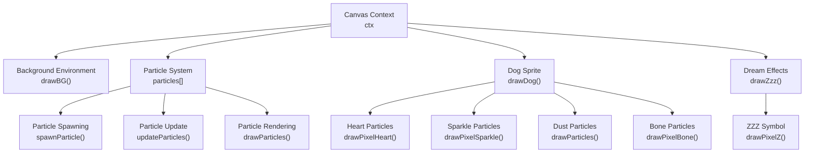
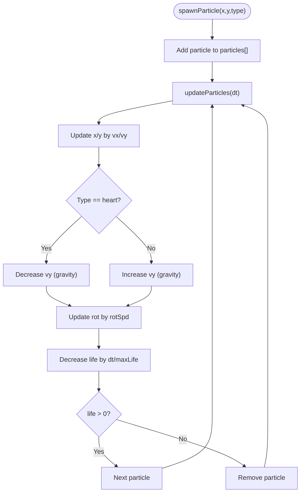
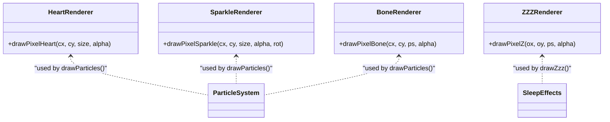
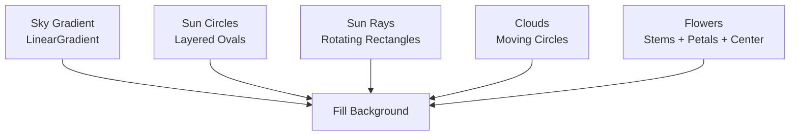
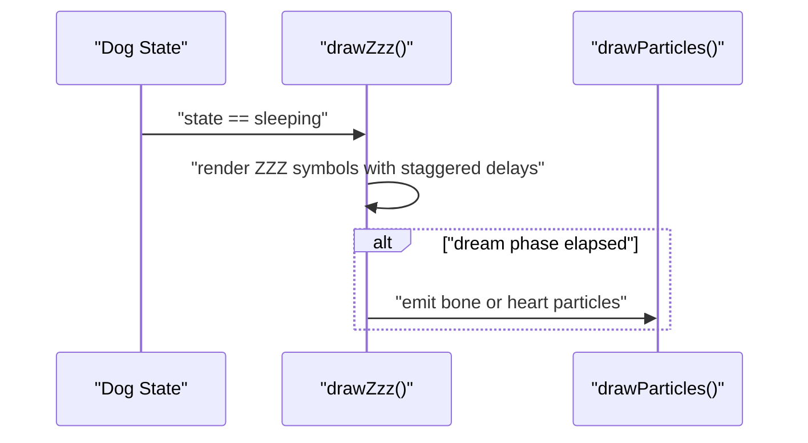
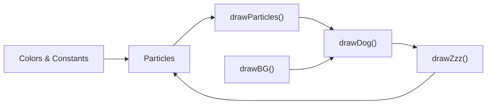

# Visual Effects System

<cite>
**Referenced Files in This Document**
- [bernese-pixel-dog.html](file://bernese-pixel-dog.html)
</cite>

## Table of Contents
1. [Introduction](#introduction)
2. [Project Structure](#project-structure)
3. [Core Components](#core-components)
4. [Architecture Overview](#architecture-overview)
5. [Detailed Component Analysis](#detailed-component-analysis)
6. [Dependency Analysis](#dependency-analysis)
7. [Performance Considerations](#performance-considerations)
8. [Troubleshooting Guide](#troubleshooting-guide)
9. [Conclusion](#conclusion)

## Introduction
This document explains the visual effects system implemented in the pixel-art scene. It covers:
- A particle system with four effect types: heart particles for happiness reactions, sparkle particles for resting states, dust particles for movement, and bone particles for dreaming states
- Custom pixel-art rendering functions for hearts, sparkles, bones, and ZZZ symbols
- An animated background environment with sky gradient, rotating sun with rays, moving clouds, and swaying flowers
- Color schemes, animation timing, and visual feedback mechanisms
- Performance considerations for particle management and rendering optimization

## Project Structure
The entire visual effects system is implemented in a single HTML file. It uses a canvas-based renderer with pixel-art aesthetics and a fixed-timestep loop to ensure smooth animations.



**Diagram sources**
- [bernese-pixel-dog.html:557-634](file://bernese-pixel-dog.html#L557-L634)
- [bernese-pixel-dog.html:78-162](file://bernese-pixel-dog.html#L78-L162)
- [bernese-pixel-dog.html:257-555](file://bernese-pixel-dog.html#L257-L555)
- [bernese-pixel-dog.html:735-768](file://bernese-pixel-dog.html#L735-L768)

**Section sources**
- [bernese-pixel-dog.html:45-58](file://bernese-pixel-dog.html#L45-L58)
- [bernese-pixel-dog.html:557-634](file://bernese-pixel-dog.html#L557-L634)

## Core Components
- Particle system: central state array and lifecycle functions for spawning, updating, and rendering
- Pixel-art drawing primitives: dedicated functions for hearts, sparkles, bones, and ZZZ symbols
- Background environment: animated sky gradient, rotating sun with rays, moving clouds, and swaying flowers
- State-driven effects: dream bubbles and ZZZ symbols during sleep, occasional sparkles during rest

Key implementation references:
- Particle system definition and lifecycle: [bernese-pixel-dog.html:78-162](file://bernese-pixel-dog.html#L78-L162)
- Pixel-art drawing functions: [bernese-pixel-dog.html:106-184](file://bernese-pixel-dog.html#L106-L184)
- Background environment: [bernese-pixel-dog.html:557-634](file://bernese-pixel-dog.html#L557-L634)
- Dream effects and ZZZ symbols: [bernese-pixel-dog.html:735-768](file://bernese-pixel-dog.html#L735-L768)

**Section sources**
- [bernese-pixel-dog.html:78-162](file://bernese-pixel-dog.html#L78-L162)
- [bernese-pixel-dog.html:106-184](file://bernese-pixel-dog.html#L106-L184)
- [bernese-pixel-dog.html:557-634](file://bernese-pixel-dog.html#L557-L634)
- [bernese-pixel-dog.html:735-768](file://bernese-pixel-dog.html#L735-L768)

## Architecture Overview
The rendering pipeline follows a fixed-timestep loop:
- Accumulate real-time delta
- While accumulated time reaches the fixed step, advance simulation (step and updateParticles)
- Interpolate between previous and current positions for smooth motion
- Render background, particles, dog sprite, and dream effects

```mermaid
sequenceDiagram
participant RAF as "requestAnimationFrame"
participant Loop as "loop()"
participant Step as "step(dt)"
participant PartUpd as "updateParticles(dt)"
participant BG as "drawBG()"
participant PartDraw as "drawParticles()"
participant Dog as "drawDog(rx, ry)"
participant Zzz as "drawZzz(rx, ry)"
RAF->>Loop : "frame"
Loop->>Loop : "accumulate frame time"
Loop->>Step : "step(FIXED_DT)"
Loop->>PartUpd : "updateParticles(FIXED_DT)"
Loop->>BG : "drawBG()"
Loop->>PartDraw : "drawParticles()"
Loop->>Dog : "drawDog(interpolated)"
alt "sleeping"
Loop->>Zzz : "drawZzz()"
end
```

**Diagram sources**
- [bernese-pixel-dog.html:770-794](file://bernese-pixel-dog.html#L770-L794)
- [bernese-pixel-dog.html:636-715](file://bernese-pixel-dog.html#L636-L715)
- [bernese-pixel-dog.html:93-104](file://bernese-pixel-dog.html#L93-L104)
- [bernese-pixel-dog.html:557-634](file://bernese-pixel-dog.html#L557-L634)
- [bernese-pixel-dog.html:257-555](file://bernese-pixel-dog.html#L257-L555)
- [bernese-pixel-dog.html:735-768](file://bernese-pixel-dog.html#L735-L768)

## Detailed Component Analysis

### Particle System
- Data model: Each particle stores position, velocity, rotation, size, lifetime, and type
- Spawning: Randomized initial velocities and sizes per type; lifetime varies by type
- Physics: Gravity-like acceleration differs by type; rotation updates each frame
- Rendering: Type-specific drawing functions; alpha fades with remaining life



**Diagram sources**
- [bernese-pixel-dog.html:78-104](file://bernese-pixel-dog.html#L78-L104)

Effect types and behaviors:
- Heart particles: upward drift with gravity, pink and red blocks, small size variation
- Sparkle particles: rotated cross shape, white and light yellow center, fade out
- Dust particles: small squares, muted brown, short lifetime, emitted during movement
- Bone particles: emitted during dreams, rendered as a pixelated bone pattern

Rendering and spawning references:
- Spawning and physics: [bernese-pixel-dog.html:80-104](file://bernese-pixel-dog.html#L80-L104)
- Rendering: [bernese-pixel-dog.html:145-162](file://bernese-pixel-dog.html#L145-L162)
- Heart drawing: [bernese-pixel-dog.html:106-129](file://bernese-pixel-dog.html#L106-L129)
- Sparkle drawing: [bernese-pixel-dog.html:131-143](file://bernese-pixel-dog.html#L131-L143)
- Dust rendering: [bernese-pixel-dog.html:152-158](file://bernese-pixel-dog.html#L152-L158)
- Bone drawing: [bernese-pixel-dog.html:165-184](file://bernese-pixel-dog.html#L165-L184)

**Section sources**
- [bernese-pixel-dog.html:78-162](file://bernese-pixel-dog.html#L78-L162)
- [bernese-pixel-dog.html:106-184](file://bernese-pixel-dog.html#L106-L184)

### Pixel-Art Drawing Functions
- Heart: 7x6 pixel pattern with red core and pink highlights
- Sparkle: rotated cross with centered dot
- Bone: outlined pixel grid with black and cream colors
- ZZZ: stacked pixel “Z” shapes with stroke outline



**Diagram sources**
- [bernese-pixel-dog.html:106-184](file://bernese-pixel-dog.html#L106-L184)
- [bernese-pixel-dog.html:735-768](file://bernese-pixel-dog.html#L735-L768)

**Section sources**
- [bernese-pixel-dog.html:106-184](file://bernese-pixel-dog.html#L106-L184)
- [bernese-pixel-dog.html:735-768](file://bernese-pixel-dog.html#L735-L768)

### Background Environment System
- Animated sky gradient: vertical linear gradient transitioning from sky blue to green
- Rotating sun: layered circles with radial rays rotating over time
- Moving clouds: periodic horizontal motion with overlapping circles
- Swaying flowers: sine-based lateral oscillation with colored petals and central dots



**Diagram sources**
- [bernese-pixel-dog.html:557-634](file://bernese-pixel-dog.html#L557-L634)

**Section sources**
- [bernese-pixel-dog.html:557-634](file://bernese-pixel-dog.html#L557-L634)

### Dream Effects and ZZZ Symbols
- ZZZ symbols: three “Z” shapes with staggered delays, easing, floating, and pulsing alpha
- Dream bubbles: alternating bone and heart symbols during dreaming phase
- Triggered by sleeping state and dream phase timer



**Diagram sources**
- [bernese-pixel-dog.html:735-768](file://bernese-pixel-dog.html#L735-L768)
- [bernese-pixel-dog.html:145-162](file://bernese-pixel-dog.html#L145-L162)

**Section sources**
- [bernese-pixel-dog.html:735-768](file://bernese-pixel-dog.html#L735-L768)

## Dependency Analysis
- Particles depend on global state (colors, constants) and are drawn after background and before the dog sprite
- Dream effects depend on the dog’s sleeping state and dream phase timer
- Background rendering is independent and runs first each frame



**Diagram sources**
- [bernese-pixel-dog.html:59-61](file://bernese-pixel-dog.html#L59-L61)
- [bernese-pixel-dog.html:78-162](file://bernese-pixel-dog.html#L78-L162)
- [bernese-pixel-dog.html:557-634](file://bernese-pixel-dog.html#L557-L634)
- [bernese-pixel-dog.html:735-768](file://bernese-pixel-dog.html#L735-L768)

**Section sources**
- [bernese-pixel-dog.html:59-61](file://bernese-pixel-dog.html#L59-L61)
- [bernese-pixel-dog.html:78-162](file://bernese-pixel-dog.html#L78-L162)
- [bernese-pixel-dog.html:557-634](file://bernese-pixel-dog.html#L557-L634)
- [bernese-pixel-dog.html:735-768](file://bernese-pixel-dog.html#L735-L768)

## Performance Considerations
- Fixed timestep: The loop advances simulation in small steps to keep physics deterministic and smooth
- Particle lifecycle: Removal when life ends prevents unbounded growth
- Minimal allocations: Reuse of arrays and in-place updates reduce GC pressure
- Rendering order: Background first, then particles, then sprites minimizes overdraw
- Alpha blending: Using globalAlpha avoids per-pixel color computations
- Pixelated rendering: Canvas image smoothing disabled for crisp pixel-art visuals

Optimization references:
- Fixed timestep loop: [bernese-pixel-dog.html:770-794](file://bernese-pixel-dog.html#L770-L794)
- Particle removal: [bernese-pixel-dog.html:101-103](file://bernese-pixel-dog.html#L101-L103)
- Canvas pixelated rendering: [bernese-pixel-dog.html:54](file://bernese-pixel-dog.html#L54)

**Section sources**
- [bernese-pixel-dog.html:770-794](file://bernese-pixel-dog.html#L770-L794)
- [bernese-pixel-dog.html:101-103](file://bernese-pixel-dog.html#L101-L103)
- [bernese-pixel-dog.html:54](file://bernese-pixel-dog.html#L54)

## Troubleshooting Guide
Common issues and checks:
- Particles not appearing
  - Verify particle spawning calls occur in response to state transitions
  - Confirm drawParticles executes after background and before drawDog
  - References: [bernese-pixel-dog.html:80-104](file://bernese-pixel-dog.html#L80-L104), [bernese-pixel-dog.html:145-162](file://bernese-pixel-dog.html#L145-L162)
- Dream effects not visible
  - Ensure sleeping state and dream phase timer are set
  - Confirm drawZzz is invoked only when sleeping
  - References: [bernese-pixel-dog.html:735-768](file://bernese-pixel-dog.html#L735-L768)
- Background elements flicker or jitter
  - Check that drawBG runs before drawDog and drawParticles
  - Ensure consistent use of Math.round for pixel alignment
  - References: [bernese-pixel-dog.html:557-634](file://bernese-pixel-dog.html#L557-L634)
- Performance drops with many particles
  - Monitor particle count and remove off-screen or expired particles
  - References: [bernese-pixel-dog.html:101-103](file://bernese-pixel-dog.html#L101-L103)

**Section sources**
- [bernese-pixel-dog.html:80-104](file://bernese-pixel-dog.html#L80-L104)
- [bernese-pixel-dog.html:145-162](file://bernese-pixel-dog.html#L145-L162)
- [bernese-pixel-dog.html:735-768](file://bernese-pixel-dog.html#L735-L768)
- [bernese-pixel-dog.html:557-634](file://bernese-pixel-dog.html#L557-L634)
- [bernese-pixel-dog.html:101-103](file://bernese-pixel-dog.html#L101-L103)

## Conclusion
The visual effects system combines a compact particle engine with custom pixel-art rendering and an animated background to deliver charming, responsive feedback. The fixed-timestep loop ensures consistent behavior, while targeted drawing functions and careful alpha blending produce crisp, readable visuals. The system balances performance and expressiveness, enabling state-driven effects like ZZZ symbols and dream bubbles during sleep, and ambient sparkles during rest.